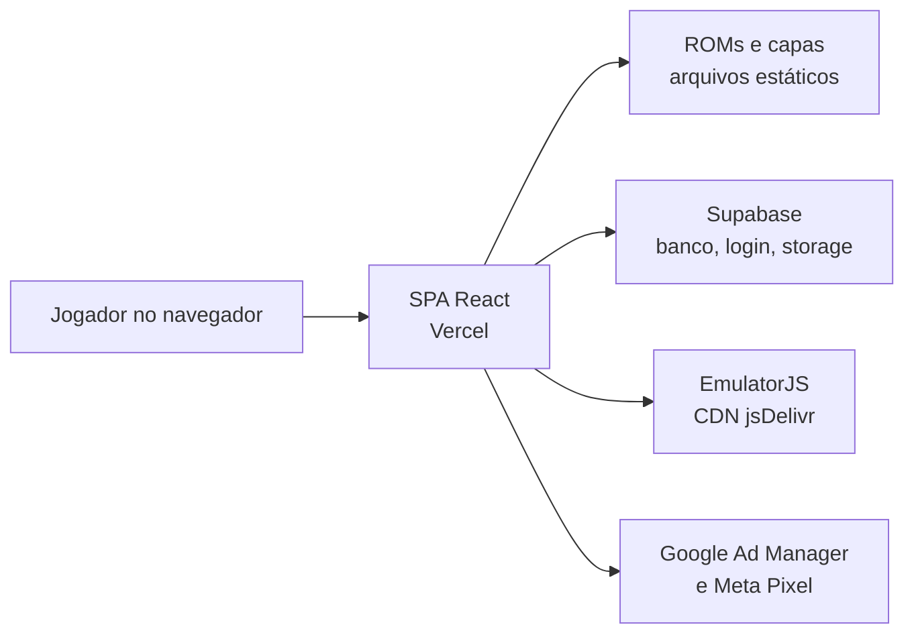
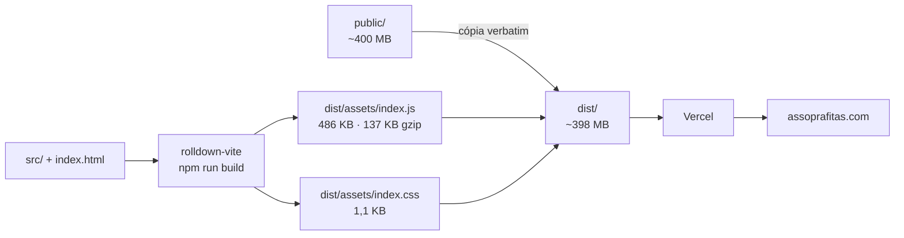

# Sopra Fitas

Emulador de videogames clássicos que roda dentro do navegador, sem instalar nada. O jogador escolhe uma fita do acervo, joga na hora, e pode enviar print da pontuação para ganhar pontos, subir no ranking e disputar os desafios do mês.

**Produção:** <https://assoprafitas.com>
**Repositório:** `git@github.com:Assopra-fita/Sopra-Fitas.git` — branch principal `main`

---

## Sumário

- [O que é, em um minuto](#o-que-é-em-um-minuto)
- [Stack](#stack)
- [Rodando localmente](#rodando-localmente)
- [Scripts disponíveis](#scripts-disponíveis)
- [Estrutura de diretórios](#estrutura-de-diretórios)
- [Build e deploy](#build-e-deploy)
- [Onde mexer para mudar cada coisa](#onde-mexer-para-mudar-cada-coisa)
- [Armadilhas do repositório](#armadilhas-do-repositório)
- [Documentação complementar](#documentação-complementar)

---

## O que é, em um minuto

É uma SPA em React, sem backend próprio. O navegador fala direto com três coisas: o **Supabase** (banco, autenticação e armazenamento de arquivos), o **CDN do EmulatorJS** (o emulador em si, carregado em runtime) e a **Vercel**, que serve tanto o site quanto as ROMs como arquivos estáticos.



Não existe servidor de aplicação, não existe API própria. Toda regra de negócio que precisa ser confiável tem que viver nas *policies* do Postgres, porque o cliente é público por definição.

## Stack

| Peça | Versão | Observação |
| --- | --- | --- |
| React | 19.2 | sem `StrictMode` — ver [`src/main.jsx`](src/main.jsx#L6) |
| React Router | 7.11 | `BrowserRouter`, 13 rotas planas, sem rotas aninhadas |
| Supabase JS | 2.90 | cliente único exportado de [`src/supabaseClient.js`](src/supabaseClient.js#L9) |
| lucide-react | 0.562 | biblioteca de ícones |
| rolldown-vite | 7.2.5 | **não é o Vite** — ver abaixo |
| ESLint | 9.39 | flat config |
| Prettier | 3.8 | configurado, mas sem script que o execute |

> **Sobre o `vite`:** o pacote instalado sob o nome `vite` é na verdade o `rolldown-vite`, por causa do alias em [`package.json`](package.json#L29) e do `overrides` em [`package.json`](package.json#L31-L33). É o Vite com o bundler Rolldown no lugar do Rollup. Os comandos são os mesmos, mas ao procurar documentação ou reportar bug, é `rolldown-vite`.

## Rodando localmente

Requisitos: Node 20+ (validado em **Node 24.18.0** com npm 11.16.0).

```bash
git clone git@github.com:Assopra-fita/Sopra-Fitas.git
cd Sopra-Fitas
npm install
npm run dev
```

Abre em **<http://localhost:5173>**.

Não há passo de configuração: **não existe `.env` neste projeto**. A URL e a chave do Supabase estão literais em [`src/supabaseClient.js`](src/supabaseClient.js#L4-L7), então `npm install && npm run dev` já sobe apontando para o ambiente de produção do Supabase.

> ⚠️ Como não há separação de ambientes, **tudo que você fizer rodando local escreve no banco de produção** — cadastrar jogo, aprovar missão, alterar pontos. Não existe base de desenvolvimento.

O `git clone` baixa cerca de **93 MB** de histórico e o diretório de trabalho fica com **~400 MB**, porque as ROMs são versionadas junto com o código.

## Scripts disponíveis

| Comando | O que faz |
| --- | --- |
| `npm run dev` | sobe o servidor de desenvolvimento na porta 5173 |
| `npm run build` | gera o `dist/` de produção |
| `npm run preview` | serve o `dist/` já construído, para conferir o build |
| `npm run lint` | roda o ESLint no projeto inteiro |

> `npm run lint` **não passa em um checkout limpo**: são 19 problemas pré-existentes, 17 deles erros. Se você rodar antes de commitar, os erros que aparecem não são seus. Não há script de formatação, hook de pre-commit nem CI configurado.

## Estrutura de diretórios

```text
Sopra-Fitas/
├── index.html              # shell da SPA + tags de anúncio e Meta Pixel
├── vite.config.js          # config do build (mínima: só o plugin do React)
├── vercel.json             # rewrite catch-all para a SPA
├── eslint.config.js
├── .prettierrc
│
├── src/                    # TODO o código-fonte — 24 arquivos, ~5.000 linhas
│   ├── main.jsx            # bootstrap (6 linhas)
│   ├── App.jsx             # as 13 rotas do produto (62 linhas)
│   ├── supabaseClient.js   # cliente Supabase singleton (9 linhas)
│   ├── index.css           # único CSS importado (91 linhas)
│   ├── App.css             # ÓRFÃO: nenhum arquivo importa
│   ├── constants/
│   │   └── games.js        # catálogo estático (518 linhas)
│   ├── pages/              # 13 arquivos, uma página por rota
│   ├── components/         # 4 arquivos, só 2 em uso
│   └── assets/             # órfão do template Vite
│
├── public/                 # ~400 MB de binários, copiados verbatim para o dist
│   ├── *.sfc *.md *.nes …  # ROMs
│   ├── *.jpg *.png         # capas
│   ├── roms/               # NÃO REFERENCIADA por nenhuma linha de código
│   ├── capas/              # NÃO REFERENCIADA por nenhuma linha de código
│   ├── ads.txt
│   └── manifest.json
│
└── dist/                   # gerado pelo build, não versionado
```

O que **não existe** e vale saber de antemão: nenhum `Context`/`Provider`, nenhum hook customizado, nenhum componente de layout ou header compartilhado, nenhum teste, nenhum TypeScript, nenhuma pasta de migrations do banco.

### Ordem sugerida de leitura

Não há um "core": há três arquivos que concentram quase tudo e o resto são folhas.

1. [`src/main.jsx`](src/main.jsx) → [`src/App.jsx`](src/App.jsx) → [`src/supabaseClient.js`](src/supabaseClient.js) — o esqueleto, 77 linhas somadas
2. [`src/constants/games.js`](src/constants/games.js) — dados puros, entenda o formato antes do resto
3. [`src/pages/Home.jsx`](src/pages/Home.jsx) — 894 linhas, o maior arquivo; concentra sessão, catálogo, busca, favoritos, ranking e anúncios
4. [`src/pages/GameRoom.jsx`](src/pages/GameRoom.jsx) — 688 linhas; emulador, controles e envio de missão
5. [`src/components/Emulator.jsx`](src/components/Emulator.jsx) — a ponte com o EmulatorJS
6. As sete telas de admin — todas são variações do mesmo padrão: um `useEffect` de busca, um handler de escrita, estilos inline

## Build e deploy



O build gera **um único bundle**, sem divisão de código: as sete telas administrativas viajam no mesmo arquivo que o visitante anônimo baixa.

O [`vercel.json`](vercel.json) tem apenas um *rewrite* que manda qualquer caminho para o `index.html`. É o que faz as rotas da SPA funcionarem em acesso direto — e tem um efeito colateral importante descrito abaixo.

## Onde mexer para mudar cada coisa

Como 100% do estilo é inline no JSX e não há componente compartilhado, não existe "um lugar óbvio" para nada. Este mapa economiza a busca cega:

| Quero mudar… | Mexo em |
| --- | --- |
| Adicionar ou remover uma rota | [`src/App.jsx:27-57`](src/App.jsx#L27-L57) — única tabela de rotas |
| Apontar para outro projeto Supabase | [`src/supabaseClient.js:4-7`](src/supabaseClient.js#L4-L7) — único lugar |
| Adicionar um jogo pelo código | **uma** entrada em [`src/constants/games.js`](src/constants/games.js), com os nove campos — ver [CATALOGO-DE-JOGOS.md](docs/CATALOGO-DE-JOGOS.md) |
| Grade, busca, filtros ou paginação da vitrine | [`src/pages/Home.jsx`](src/pages/Home.jsx) e o bloco `.home__` de [`src/styles/paginas.css`](src/styles/paginas.css); as categorias saem de [`src/constants/consoles.js`](src/constants/consoles.js) |
| Barra de controles do emulador | [`src/pages/GameRoom.jsx`](src/pages/GameRoom.jsx); o visual e os três modos de tela em [`src/styles/jogo.css`](src/styles/jogo.css) |
| Versão ou CDN do EmulatorJS | [`src/components/Emulator.jsx:39`](src/components/Emulator.jsx#L39) e `:45` — os dois únicos pontos |
| Anúncios | slots em [`index.html:35-63`](index.html#L35-L63); âncoras em `Home.jsx:397` e `:603`, `GameRoom.jsx:269` e `:584` |
| Meta Pixel | [`index.html:69-103`](index.html#L69-L103) |
| Altura da tela de jogo (`100vh`/`100dvh`) | [`src/styles/jogo.css`](src/styles/jogo.css) |
| Regra de celular deitado | media query no fim de [`src/styles/jogo.css`](src/styles/jogo.css) — não é mais JavaScript |
| Breakpoints da Home | [`src/styles/paginas.css`](src/styles/paginas.css); o único que sobrou em JavaScript decide quantos números a paginação mostra, em [`src/hooks/useBreakpoint.js`](src/hooks/useBreakpoint.js) |
| Logo da Home | `public/logo.webp`, usado em [`src/pages/Home.jsx`](src/pages/Home.jsx) e no cabeçalho em [`src/components/home/CabecalhoHome.jsx`](src/components/home/CabecalhoHome.jsx) |
| Favicon e título | [`index.html`](index.html); o título por rota vem de [`src/hooks/useTituloDaPagina.js`](src/hooks/useTituloDaPagina.js) |
| Nome, ícone e cores do app instalado | [`public/manifest.json`](public/manifest.json) e os `public/icone-*.png` |
| O que fica guardado para funcionar sem rede | [`public/sw.js`](public/sw.js) |
| Cor de cada coisa, espaçamento, raio | [`src/styles/tokens.css`](src/styles/tokens.css) — mexer aqui muda o site inteiro |
| Qualquer consulta ao banco | [`src/services/`](src/services/) — nenhuma tela monta consulta |
| Comportamento de rota inexistente em produção | [`vercel.json`](vercel.json) |

## Armadilhas do repositório

Coisas que não aparecem em nenhuma busca por `import` e que quebram silenciosamente.

**O site é instalável, e isso vem com um service worker.** [`public/sw.js`](public/sw.js) guarda a casca e os arquivos com hash no nome, para o site abrir sem rede. Três coisas a saber antes de mexer nele:

- ele **não** guarda ROM, nada do Supabase e nada do CDN do emulador, e isso é deliberado: o acervo passa de 70 MB e estourar a cota faz o navegador apagar o cache inteiro sem avisar
- a navegação é sempre rede primeiro, então um deploy novo chega na primeira visita. Se você inverter isso para acelerar, passa a existir gente presa em versão velha
- ao mudar a estratégia de cache, suba a constante `VERSAO`: é o que apaga o que ficou para trás

Se algum dia o service worker causar problema em produção, a saída é publicar um `sw.js` que chama `self.registration.unregister()` e apaga os caches. Isso devolve o site ao estado sem service worker no próximo carregamento — testado.

**`.md` aqui não é Markdown.** São 45 ROMs de Mega Drive com extensão `.md` dentro de `public/`, algumas com 8 MB. Um `find . -name '*.md'` ou um Prettier apontado para a raiz vai bater nelas. Os únicos Markdown de verdade são este README e os arquivos em `docs/`.

Pior: **as 22 ROMs `.md` da raiz de `public/` estão todas corrompidas** — foram re-encodadas como texto UTF-8 e todo byte `>= 0x80` virou `EF BF BD`. Os tamanhos estão inflados de 1,6× a 2× e não são potência de 2. As ROMs SEGA em `.smd` e `.bin` estão intactas; a corrupção atingiu só a extensão `.md`. Detalhe na seção "Como o acervo está hoje" de [CATALOGO-DE-JOGOS.md](docs/CATALOGO-DE-JOGOS.md).

**Nada retorna 404 em produção.** O rewrite catch-all do [`vercel.json`](vercel.json) faz qualquer arquivo inexistente responder `200` com o HTML da SPA. Um `rom_url` errado não dá erro: o emulador recebe HTML no lugar da ROM e mostra tela preta. Falhas de asset são silenciosas por construção — sempre confira o `content-type`, não o status.

**Os IDs das `div` de anúncio são acoplamento por string.** Os slots são registrados uma única vez em [`index.html:36-46`](index.html#L36-L46), e o componente [`AnuncioGPT`](src/components/AnuncioGPT.jsx) só chama `display()` sobre um ID já registrado. Renomear um ID no HTML sem renomear nas quatro chamadas mata o anúncio sem nenhum erro no console.

**O emulador vive em variáveis globais de `window`.** [`src/components/Emulator.jsx:36-41`](src/components/Emulator.jsx#L36-L41) define seis globais `window.EJS_*` e há **duas** rotinas de limpeza com implementações divergentes — uma em `Emulator.jsx:8-31`, outra em `GameRoom.jsx:47-68`. Os IDs de DOM `#game` e `#tela-do-jogo` são alvo direto dessas rotinas e do fullscreen: renomear qualquer um quebra emulador ou tela cheia.

**O botão "Sair" do jogo recarrega a página de propósito.** [`src/pages/GameRoom.jsx:117-120`](src/pages/GameRoom.jsx#L117-L120) usa `window.location.href` em vez de `navigate()` para forçar o reset do `AudioContext` do navegador. Trocar por navegação SPA reintroduz o bug de áudio que continua tocando depois de sair do jogo.

**O CDN do emulador aponta para uma branch, não para uma versão.** [`src/components/Emulator.jsx:39`](src/components/Emulator.jsx#L39) e `:45` usam `@main`: um commit no repositório de terceiros pode mudar o comportamento em produção sem nenhum commit aqui.

**`public/roms/` e `public/capas/` não são usadas.** Nenhuma linha de código aponta para elas. São cópias byte a byte do que já está na raiz de `public/` — cerca de 200 MB duplicados que vão para o deploy.

## Documentação complementar

| Documento | Conteúdo |
| --- | --- |
| [docs/ARQUITETURA.md](docs/ARQUITETURA.md) | visão geral, mapa de rotas, modelo de dados, fluxos ponta a ponta e as decisões de design com o porquê |
| [docs/CATALOGO-DE-JOGOS.md](docs/CATALOGO-DE-JOGOS.md) | como adicionar um jogo pelos dois caminhos, tabela de consoles e cores, onde ficam os binários |

---

*Documentação levantada a partir da leitura do código em agosto de 2026. Onde a informação depende de configuração fora do repositório — policies do Supabase, painel do Google Ad Manager, painel da Vercel — isso está marcado explicitamente no documento correspondente.*
