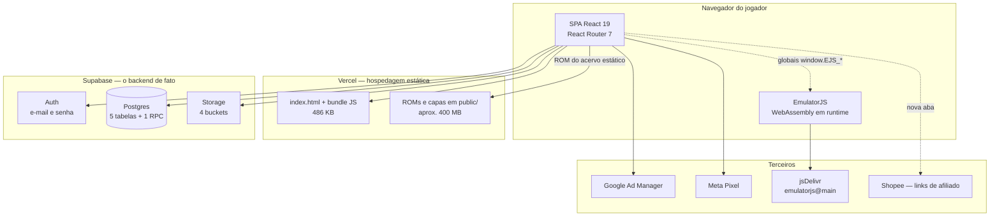
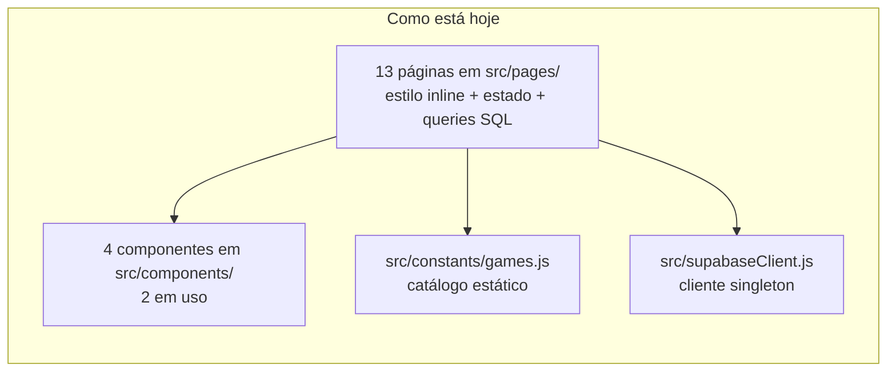
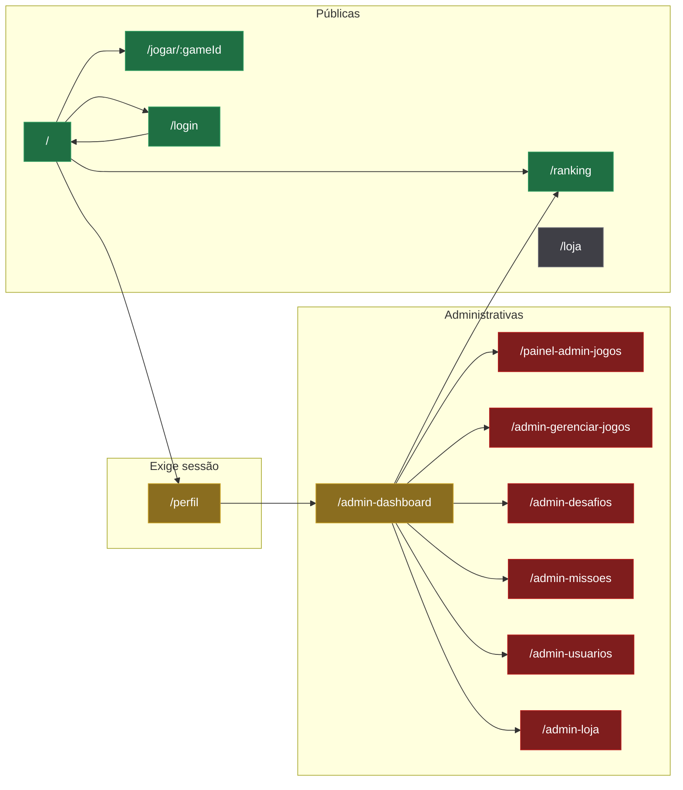
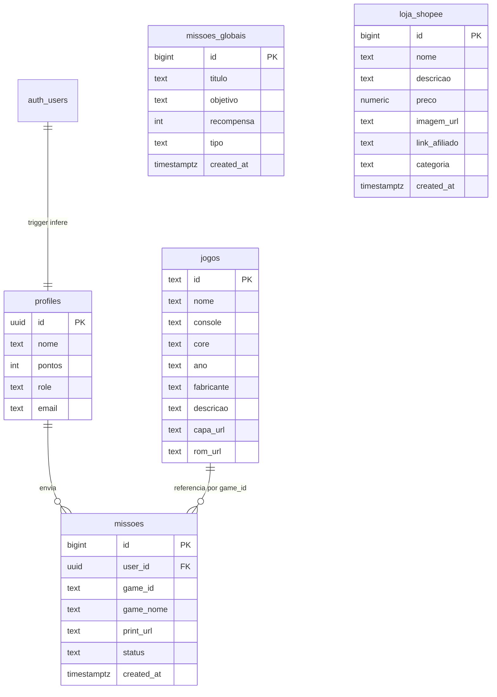
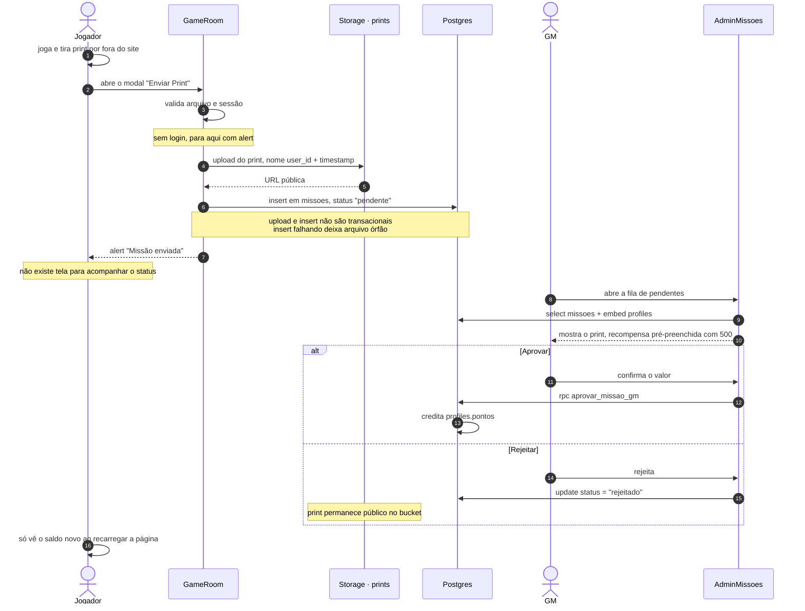
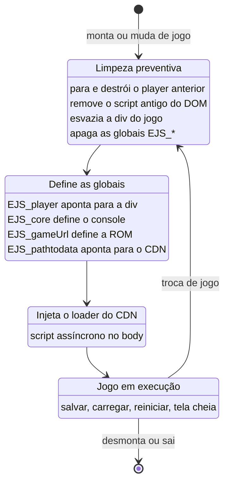
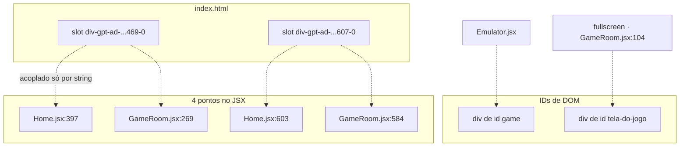

# Arquitetura — Sopra Fitas

Este documento descreve **como o sistema funciona hoje**, não como deveria funcionar. Cada afirmação vem da leitura do código e aponta o arquivo e a linha correspondente. O que depende de configuração fora do repositório está marcado como **⚠ confirmar fora do repo**.

- [1. Visão geral](#1-visão-geral)
- [2. Camadas e responsabilidades](#2-camadas-e-responsabilidades)
- [3. Mapa de rotas](#3-mapa-de-rotas)
- [4. Modelo de dados](#4-modelo-de-dados)
- [5. Fluxos ponta a ponta](#5-fluxos-ponta-a-ponta)
- [6. Decisões arquiteturais e o porquê](#6-decisões-arquiteturais-e-o-porquê)
- [7. Contratos frágeis](#7-contratos-frágeis)
- [8. O que precisa ser confirmado fora do repositório](#8-o-que-precisa-ser-confirmado-fora-do-repositório)

---

## 1. Visão geral

O Sopra Fitas é uma **SPA React sem backend próprio**. Não existe servidor de aplicação, não existe API intermediária: o navegador do jogador conversa diretamente com o Supabase, com o CDN que hospeda o emulador e com as redes de anúncio.

A consequência mais importante dessa topologia: **o cliente é público e não pode ser fonte de confiança**. Toda regra que precisa valer de verdade — quem é administrador, quem pode alterar pontos, quem pode apagar um jogo — só existe se estiver escrita nas *policies* de RLS do Postgres. O código React pode escondê-las da tela, mas não impedi-las.

## 2. Camadas e responsabilidades

O projeto não tem camadas separadas. Cada página React acumula apresentação, estado, orquestração e acesso a dados no mesmo arquivo.

O que **não existe** e explica muita coisa do código:

| Ausente | Consequência prática |
| --- | --- |
| `Context` / store de sessão | cinco páginas chamam `supabase.auth` por conta própria; login em uma aba não atualiza outra rota |
| Camada de serviço / repositório | as queries SQL estão espalhadas dentro dos componentes |
| Hooks customizados | nenhum arquivo `use*.js` em `src/` |
| Componente de layout / header | cada página redesenha o próprio cabeçalho |
| Guard de rota | a proteção administrativa está dentro de uma única página |
| Testes | nenhum arquivo de teste e nenhum runner no `package.json` |

## 3. Mapa de rotas

Treze rotas planas, todas declaradas em [`src/App.jsx:27-57`](../src/App.jsx#L27-L57). Sem rotas aninhadas, sem layout compartilhado, sem `lazy`, sem rota `*` de 404.

**Verde** = pública sem restrição · **Amarelo** = verifica sessão ou papel no cliente · **Vermelho** = nenhuma verificação · **Cinza** = rota órfã

Três observações que saem desse mapa:

**`/loja` é órfã.** Nenhuma página do produto linka para ela — só é alcançável digitando a URL. O CSS de um botão de topo que aparentemente serviria para isso existe em [`src/index.css:60-74`](../src/index.css#L60-L74), mas nenhum JSX usa a classe.

**Seis rotas administrativas não verificam nada.** A única verificação de papel do app inteiro está em [`src/pages/AdminDashboard.jsx:28-46`](../src/pages/AdminDashboard.jsx#L28-L46). As outras seis telas de GM não chamam `supabase.auth` em momento algum. Vale reforçar: mesmo o `AdminDashboard` apenas *redireciona* — proteção de tela, não de dados.

**A navegação perde o contexto.** Nem busca, nem filtro, nem página atual vão para a URL ([`src/pages/Home.jsx:30-33`](../src/pages/Home.jsx#L30-L33)). Voltar de um jogo devolve o jogador para a primeira página da grade.

## 4. Modelo de dados

⚠ **Todo este schema é inferido do uso.** Não há DDL, migrations nem pasta `supabase/` no repositório. As colunas abaixo são as que o código efetivamente lê ou escreve; tipos, chaves, `NOT NULL` e defaults precisam ser confirmados no painel.

### Onde cada tabela é tocada

| Tabela | Leitura | Escrita |
| --- | --- | --- |
| `profiles` | `Home.jsx:78`, `Perfil.jsx:27`, `Ranking.jsx:31`, `AdminDashboard.jsx:37`, `AdminUsuarios.jsx:15` | `Perfil.jsx:49` (nome), `AdminUsuarios.jsx:34` (pontos), `AdminUsuarios.jsx:49` (role) |
| `jogos` | `Home.jsx:60`, `GameRoom.jsx:192` e `:207`, `AdminGerenciarJogos.jsx:17` | `AdminJogos.jsx:59` (insert), `AdminGerenciarJogos.jsx:28` (update), `:41` (delete) |
| `missoes` | `AdminMissoes.jsx:26`, `AdminDashboard.jsx:56` | `GameRoom.jsx:163` (insert), `AdminMissoes.jsx:72` (rejeitar) |
| `missoes_globais` | `Home.jsx:104`, `AdminDesafios.jsx:24` | `AdminDesafios.jsx:40` (insert), `:61` (delete) |
| `loja_shopee` | `Loja.jsx:14`, `AdminLoja.jsx:23` | `AdminLoja.jsx:59` (insert/update), `:104` (delete) |

### Buckets de Storage

Quatro buckets, todos consumidos via `getPublicUrl` — **não há URL assinada em lugar nenhum do projeto**.

| Bucket | Escrito em | Padrão do nome do arquivo |
| --- | --- | --- |
| `prints` | [`GameRoom.jsx:154`](../src/pages/GameRoom.jsx#L154) | `{user_id}_{timestamp}.{ext}` |
| `capas` | [`AdminJogos.jsx:39`](../src/pages/AdminJogos.jsx#L39) | `{id}-capa.{ext}` — com `upsert` |
| `roms` | [`AdminJogos.jsx:50`](../src/pages/AdminJogos.jsx#L50) | `{id}.{ext}` — com `upsert` |
| `imagens_loja` | [`AdminLoja.jsx:39`](../src/pages/AdminLoja.jsx#L39) | `{timestamp}.{ext}` — com `upsert` |

### A única função no banco

`aprovar_missao_gm(id_missao, id_jogador, qtd_pontos)`, chamada por RPC em [`AdminMissoes.jsx:57-61`](../src/pages/AdminMissoes.jsx#L57-L61). **É o único ponto do sistema que credita pontos por missão** — não existe nenhum `update` de `pontos` no cliente nesse fluxo. O corpo da função não está no repositório. ⚠ confirmar fora do repo.

### Nenhum delete limpa o Storage

Os três deletes do app removem apenas a linha do banco. Os arquivos ficam órfãos nos buckets, e o Storage cresce indefinidamente:

- [`AdminGerenciarJogos.jsx:41`](../src/pages/AdminGerenciarJogos.jsx#L41) apaga o jogo, mas a ROM e a capa continuam em `roms` e `capas`
- [`AdminLoja.jsx:104`](../src/pages/AdminLoja.jsx#L104) apaga o produto, mas a imagem continua em `imagens_loja`
- [`AdminMissoes.jsx:72`](../src/pages/AdminMissoes.jsx#L72) só muda o status para `rejeitado`; o print continua público em `prints`

## 5. Fluxos ponta a ponta

### 5.1 O ciclo de uma missão — de print a ponto

É o fluxo central do produto e o único jeito de ganhar pontos. **Toda a validação é humana.**

Pontos de atenção deste fluxo, todos verificados no código:

- **O upload e o insert não são transacionais entre si** ([`GameRoom.jsx:151-169`](../src/pages/GameRoom.jsx#L151-L169)). Se o insert falhar depois do upload, o arquivo fica no bucket sem nenhuma linha apontando para ele.
- **A recompensa nasce com 500 pontos pré-preenchidos** ([`AdminMissoes.jsx:35`](../src/pages/AdminMissoes.jsx#L35)); o GM confirma ou altera. Valores `<= 0` são bloqueados.
- **O jogador não tem visibilidade nenhuma.** Não existe tela de "minhas missões", nem histórico, nem notificação. Ele descobre que foi aprovado ao recarregar a Home.
- **Não há realtime.** Todo estado é buscado no `mount` da página.

### 5.2 Desafios do mês são só um mural

`missoes_globais` e `missoes` têm nomes parecidos e **zero acoplamento entre si**. O desafio do mês é texto exibido na Home; não há botão de participar, contador de progresso nem qualquer escrita. Para receber a recompensa de um desafio, o jogador envia um print pelo fluxo acima e o GM digita o valor manualmente.

### 5.3 Sessão e autenticação

```mermaid
sequenceDiagram
    autonumber
    actor U as Usuário
    participant LG as Login
    participant SB as Supabase Auth
    participant LS as localStorage
    participant HM as Home

    rect rgb(40,40,48)
    Note over U,SB: Cadastro
    U->>LG: e-mail + senha
    LG->>SB: signUp
    SB-->>LG: ok
    LG-->>U: alert "confirme seu e-mail"
    Note over SB: a linha em profiles NÃO é criada aqui<br/>presume-se trigger no banco — confirmar
    end

    rect rgb(40,40,48)
    Note over U,HM: Login
    U->>LG: e-mail + senha
    LG->>SB: signInWithPassword
    SB->>LS: grava o token de sessão
    LG->>HM: navigate("/")
    HM->>SB: getSession
    HM->>SB: select pontos, nome de profiles
    HM-->>U: header logado
    end

    Note over HM: Home é a ÚNICA página que assina onAuthStateChange<br/>e a única que tem botão de sair
```

Como não existe contexto global de sessão, cada página resolve por conta própria:

| Página | Como obtém a sessão |
| --- | --- |
| `Home` | `getSession` + `onAuthStateChange` com `unsubscribe` correto — **única página reativa** |
| `GameRoom` | `getSession` dentro do efeito de `[gameId]` |
| `Perfil` | `getSession` no mount e **de novo** a cada clique em salvar |
| `Ranking` | `getUser`, só para decidir o destino do botão "voltar" |
| `AdminDashboard` | `getUser` na verificação de papel |
| `Login` | não consulta nada — **a tela é acessível mesmo já logado** |
| `Loja` e as outras 6 telas de admin | nenhuma chamada de autenticação |

Consequência: o **logout só existe na Home** ([`Home.jsx:143`](../src/pages/Home.jsx#L143)). Estando em `/perfil` ou `/jogar/:id`, é preciso voltar para a Home para sair. E os favoritos em `localStorage` não são limpos no logout — permanecem no navegador para o próximo usuário do mesmo dispositivo.

### 5.4 Ciclo de vida do emulador

O EmulatorJS não é uma dependência npm: é um script carregado de CDN em runtime e configurado por **variáveis globais de `window`**. Isso torna o ciclo de vida frágil e explica várias decisões estranhas do código.

Duas rotinas de limpeza coexistem, com implementações divergentes: [`Emulator.jsx:8-31`](../src/components/Emulator.jsx#L8-L31) usa `delete` nas globais, [`GameRoom.jsx:47-68`](../src/pages/GameRoom.jsx#L47-L68) atribui `null`.

#### ⚠️ `EJS_player` é um seletor, não o emulador

Este é o mal-entendido mais consequente do código e explica dois comportamentos do produto.

[`Emulator.jsx:36`](../src/components/Emulator.jsx#L36) define `window.EJS_player = '#game'` — uma **string** com o seletor CSS de onde montar o emulador. O loader do EmulatorJS lê essa string e cria a instância real numa **outra** global, `window.EJS_emulator`, que nunca é referenciada em lugar nenhum de `src/`.

Como consequência, tudo que o código chama sobre `EJS_player` opera sobre uma string:

| Onde | O que acontece de fato |
| --- | --- |
| `salvarJogo`, `carregarJogo`, `reiniciarJogo` — [`GameRoom.jsx:88-96`](../src/pages/GameRoom.jsx#L88-L96) | `if (window.EJS_player)` passa, porque string não-vazia é *truthy*; a chamada seguinte lança `TypeError`. Como não há `try/catch`, o botão falha em silêncio: **Salvar, Carregar e Reiniciar não fazem nada** |
| `finalizarEmulador` — [`GameRoom.jsx:47-68`](../src/pages/GameRoom.jsx#L47-L68) | os guards `typeof … === 'function'` são sempre falsos, então `stop()` e `destroy()` **nunca executam**; sobra apenas o `innerHTML = ''` |
| `limparTudo` — [`Emulator.jsx:8-31`](../src/components/Emulator.jsx#L8-L31) | mesma coisa |

É por isso que o botão "Sair" precisa recarregar a página inteira: como o emulador nunca é encerrado de verdade, **o reload é o único jeito que sobrou de matar o áudio**. Sair pelo botão "voltar" do navegador ou clicar num jogo relacionado deixa a música tocando por baixo do site.

A instância correta é `window.EJS_emulator` — a correção de verdade é guardá-la e chamar os métodos sobre ela, e só então a navegação SPA volta a ser viável no botão Sair.

O modo **tela de jogo compacta** é decidido em [`GameRoom.jsx:24-30`](../src/pages/GameRoom.jsx#L24-L30) e olha a **altura**, não só a largura — porque um celular deitado tem largura de desktop com altura pequena, e sem isso a tela montava o layout de três colunas em cima do jogo.

## 6. Decisões arquiteturais e o porquê

Decisões que parecem erro mas foram deliberadas, com a razão registrada no próprio código. **Quem mexer sem saber disso reintroduz o bug que elas resolvem.**

| Decisão | Onde | Por quê | O que quebra se reverter |
| --- | --- | --- | --- |
| Sair do jogo com `window.location.href`, não com `navigate()` | [`GameRoom.jsx:117-120`](../src/pages/GameRoom.jsx#L117-L120) | força o reset do `AudioContext` do navegador | o áudio do jogo continua tocando depois de sair |
| Esconder os anúncios com `display:none` em vez de desmontar | [`GameRoom.jsx:252-253`](../src/pages/GameRoom.jsx#L252-L253) | `googletag.display()` só roda uma vez por slot | o anúncio some ao voltar do modo tela cheia |
| Rolagem própria de 260 px no card de desafios | [`Home.jsx:428-431`](../src/pages/Home.jsx#L428-L431) | sem o teto, cada desafio novo estica a coluna lateral e aumenta o vão da grade | o layout da Home degrada a cada desafio cadastrado |
| Par `100vh` / `100dvh` duplicado no CSS | [`index.css:27-38`](../src/index.css#L27-L38) | fallback para navegadores sem `dvh` | barra do navegador móvel corta a tela do jogo |
| Detectar layout pela **altura** também | [`GameRoom.jsx:21-30`](../src/pages/GameRoom.jsx#L21-L30) | celular deitado tem largura de desktop | o layout de três colunas aparece por cima do jogo |
| Índice por id ao lado do array do acervo | [`games.js`](../src/constants/games.js) | a sala de jogo resolve a ROM por id a cada abertura; sem índice seriam 24 comparações por jogo | busca linear a cada abertura de jogo |

## 7. Contratos frágeis

Acoplamentos por string e por ID de DOM. Não aparecem em nenhuma busca por `import` e são a principal fonte de regressão neste código.

1. **IDs dos slots de anúncio.** Registrados uma única vez em [`index.html:36-46`](../index.html#L36-L46) e usados em quatro pontos do JSX. Renomear no HTML sem renomear nos quatro mata o anúncio sem erro no console.
2. **Os mesmos dois IDs são usados em duas páginas.** Navegar da Home para a GameRoom desmonta um par de `div` e monta outro com ID idêntico, chamando `display()` de novo para o mesmo slot — o guard do `AnuncioGPT` é por instância e não sobrevive à troca de rota. A proteção de não desmontar existe **só dentro** da GameRoom.
3. **`window.EJS_*` é estado global de documento**, com duas rotinas de teardown divergentes — e ambas operam sobre `EJS_player`, que é uma string, não o emulador (ver 5.4). A instância real vive em `window.EJS_emulator` e o código nunca a toca.
4. **`#game` e `#tela-do-jogo`** são alvo direto do emulador e do fullscreen. Renomear quebra um dos dois.
5. **`@main` no CDN** ([`Emulator.jsx:39`](../src/components/Emulator.jsx#L39) e `:45`) aponta para uma branch de terceiros, não para uma versão fixa.
6. **`animate-spin`** é usada em seis lugares e não existe: não há Tailwind no projeto nem `@keyframes` no CSS. Os ícones de carregamento simplesmente não giram.

## 8. O que precisa ser confirmado fora do repositório

Nada abaixo é verificável lendo o código. Todos são pontos onde o comportamento real do sistema depende de configuração em painel externo.

### Supabase — projeto `maataycmixcmozjhezfe`

- [ ] **Policies de RLS de cada tabela.** Este é o item mais importante da lista. Como seis rotas administrativas não verificam nada no cliente, o que realmente impede um usuário comum de escrever em `profiles`, `jogos`, `missoes_globais` ou `loja_shopee` são as policies. Confirmar em especial se `profiles.role` pode ser alterado pelo próprio usuário — é o caminho de escalada para administrador.
- [ ] **Corpo da função `aprovar_missao_gm`.** É o único ponto que credita pontos. Confirmar se além de somar em `profiles.pontos` ela também muda `missoes.status`, e se é `SECURITY DEFINER`.
- [ ] **Trigger de criação de `profiles`.** O código nunca insere em `profiles`; a linha é pressuposta como já existente após o `signUp`.
- [ ] **Foreign key de `missoes` para `profiles`.** O embed `*, profiles (nome, email)` em `AdminMissoes.jsx:28` só funciona com a FK declarada.
- [x] **Políticas dos 4 buckets** — ⚠️ **já verificado, e está aberto.** O bucket `prints` é **listável com a chave anônima** que viaja no bundle público. Como o nome do arquivo é `{user_id}_{timestamp}` ([`GameRoom.jsx:152`](../src/pages/GameRoom.jsx#L152)), cada print fica correlacionado ao `profiles.id` do autor — e `profiles` expõe nome e e-mail. Na verificação, todos os prints existentes foram associados a contas reais. **Isso é exposição de dado pessoal de usuário e deve ser tratado antes de qualquer outro item.** Ver o roadmap.
- [ ] **Site URL / Redirect URLs** do Auth, usadas na confirmação de e-mail.

### Vercel

- [ ] Se há override de framework, comando de build ou variáveis de ambiente no painel — o `vercel.json` só declara o rewrite.

### Google Ad Manager

- [ ] Se as linhas da rede `/23340104016` estão presentes no `ads.txt`. O arquivo atual contém apenas uma linha de AdSense.

---

*Documentação levantada a partir da leitura do código em agosto de 2026. Ver também [README.md](../README.md) e [CATALOGO-DE-JOGOS.md](CATALOGO-DE-JOGOS.md).*
