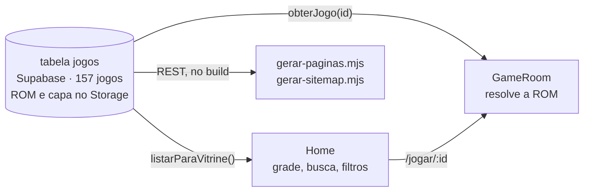
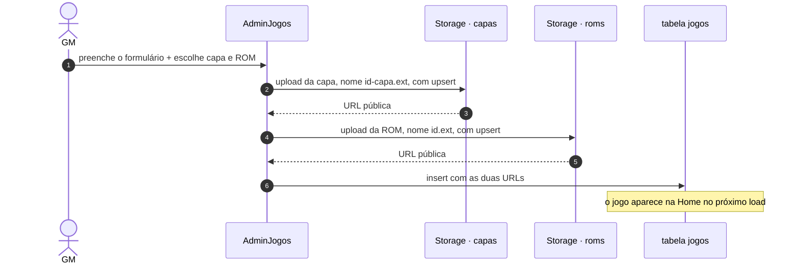
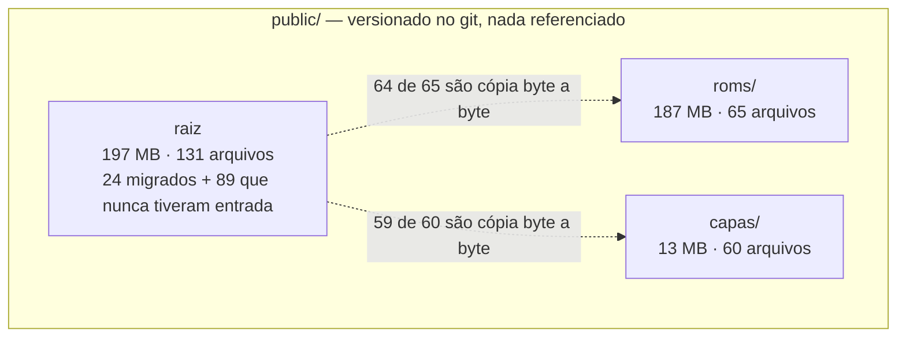
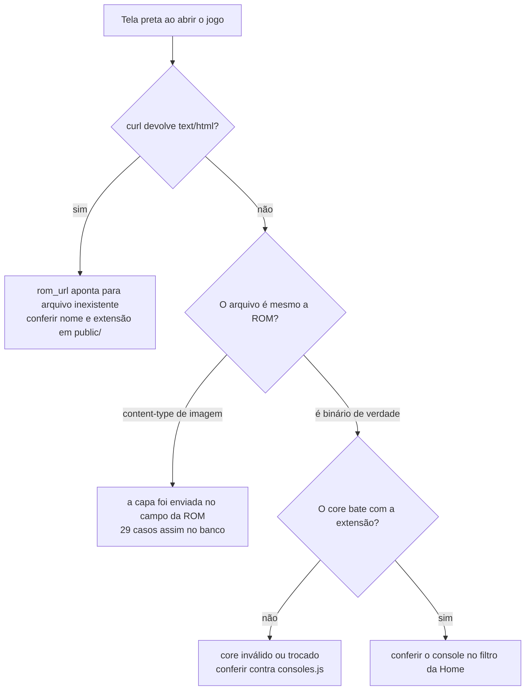

# Catálogo de jogos — como funciona e como mexer

Guia operacional do acervo. Cadastrar um jogo é a tarefa mais frequente do projeto e a que mais dava errado em silêncio, porque o catálogo tinha **duas fontes que nunca se sincronizavam**. Desde 04/09/2026 tem uma só: a tabela `jogos` do Supabase.

- [1. A fonte do catálogo](#1-a-fonte-do-catálogo)
- [2. O contrato de um jogo](#2-o-contrato-de-um-jogo)
- [3. Consoles, cores e extensões](#3-consoles-cores-e-extensões)
- [4. O acervo que existia no código](#4-o-acervo-que-existia-no-código)
- [5. Adicionar um jogo pelo painel](#5-adicionar-um-jogo-pelo-painel)
- [6. Onde ficam os binários](#6-onde-ficam-os-binários)
- [7. Como o acervo está hoje](#7-como-o-acervo-está-hoje)
- [8. Diagnóstico de "o jogo não abre"](#8-diagnóstico-de-o-jogo-não-abre)

---

## 1. A fonte do catálogo



Era assim até 04/09/2026:

| | Home | GameRoom |
| --- | --- | --- |
| Fonte lida | `games` do código **+** tabela `jogos` | acervo do código e, só se não achar, tabela `jogos` |
| Precedência | banco **na frente** do código | código **antes** do banco |

As duas precedências eram **opostas**, e isso não era detalhe de estilo: um jogo
que existisse nas duas fontes aparecia na vitrine com os dados do banco e abria
no emulador com os dados do código. Os 24 jogos do código estavam exatamente
nesse estado depois que foram para a tabela — corrigir a capa de um deles pelo
painel do GM mudava o card e não mudava o jogo.

O acervo do código foi removido. `src/constants/games.js` não existe mais, as
ROMs dele estão no balde `roms` e as capas no balde `capas`, com a mesma
convenção de nome que o painel usa: `roms/{id}.{ext}` e `capas/{id}-capa.{ext}`.

**O que se perdeu:** se o Supabase não responder, a vitrine fica vazia — antes
sobravam os 24 do código. Na sala de jogo, o título passou a depender de uma ida
à rede: medido no site no ar, em 4G com 150 ms de latência, 1204 ms pelo código
contra 1513 ms pelo banco. São 310 ms, contra os vários segundos que o emulador
leva para baixar o core e a ROM logo depois.

**O que se ganhou:** os 157 jogos são editáveis pelo painel, o repositório
parou de crescer com binário, e não existe mais o estado em que a vitrine e o
emulador discordam.

## 2. O contrato de um jogo

Toda entrada tem os **nove campos**, todos obrigatórios:

| Campo | Para que serve |
| --- | --- |
| `id` | chave da URL `/jogar/:id` |
| `nome` | título no card e na sala de jogo |
| `console` | filtro por categoria da Home — precisa existir em [`consoles.js`](../src/constants/consoles.js) |
| `core` | qual emulador carregar |
| `rom_url` | o binário |
| `capa_url` | imagem do card |
| `ano` | ficha técnica na sala de jogo |
| `fabricante` | ficha técnica na sala de jogo |
| `descricao` | texto na sala de jogo |

Do jogo resolvido, **apenas `rom_url` e `core` chegam ao emulador**. Todo o
resto é apresentação.

## 3. Consoles, cores e extensões

O que o acervo usa hoje:

| Console | `core` gravado | Extensões | Jogos | Válido? |
| --- | --- | --- | :---: | :---: |
| SNES | `snes9x` | `.sfc` `.smc` | 18 | ✅ |
| MASTER SYSTEM | `smsplus` | `.sms` | 2 | ✅ |
| NES | `nestopia` | `.nes` | 2 | ✅ |
| GBA | `mgba` | `.gba` | 2 | ✅ |
| GAME BOY | `gambatte` | `.gbc` | 1 | ✅ |
| NINTENDO 64 | `mupen64plus_next` | `.z64` | 1 | ✅ |
| ATARI | `stella` | `.a26` | 1 | ❌ **não existe** |

### As duas convenções de `core` — e qual está certa

`window.EJS_core` aceita **duas famílias de nome**, e o projeto usa uma em cada caminho de cadastro:

| Vocabulário | Exemplos | Quantos jogos usam |
| --- | --- | --- |
| **nome do sistema** | `snes`, `gba`, `nes`, `segaMD`, `gbc`, `neogeo` | 133 |
| **nome do core** | `snes9x`, `mgba`, `nestopia`, `smsplus`, `gambatte`, `stella2014`, `mupen64plus_next` | 24 |

As duas convivem porque vieram dos dois caminhos de cadastro que existiam: o
`<select>` do painel grava nome de sistema, e o acervo do código escrevia nome
de core. Com a migração os dois vocabulários ficaram na mesma tabela.

As duas funcionam, porque o EmulatorJS mantém um mapa de sistema → cores. Trecho do mapa oficial (`data/src/consts.js`):

```js
"snes":      ["snes9x", "bsnes"]
"segaMD":    ["genesis_plus_gx", "genesis_plus_gx_wide", "picodrive"]
"atari2600": ["stella2014"]
```

> **CORREÇÃO (04/09/2026).** Uma versão anterior deste guia afirmava que
> `stella` não era nem sistema nem core, que o Atari 2600 estava morto por
> causa disso, e mandava trocar por `stella2014`. **Está errado, e a troca não
> era necessária.**
>
> A parte verdadeira é o 404: `cdn.emulatorjs.org/stable/data/cores/stella-wasm.data`
> responde 404 mesmo, e `stella2014-wasm.data` responde 200. O erro foi concluir
> daí que o jogo não abre.
>
> O que o navegador realmente pede, medido em `/jogar/atari-asteroids`:
>
> | `core` gravado | Arquivos baixados |
> | --- | --- |
> | `stella` | `stella2014.json`, `stella2014-legacy-wasm.data` |
> | `snes` | `snes9x.json`, `snes9x-legacy-wasm.data` |
> | `smsplus` | `smsplus.json`, `smsplus-legacy-wasm.data` |
>
> O EmulatorJS resolve o nome pelo mapa antes de montar a URL, e o arquivo
> publicado chama-se `-legacy-wasm.data`, não `-wasm.data`. Conferir a
> existência de `{core}-wasm.data` no CDN **não** testa nada: dá 404 para todos
> os 13 cores do acervo, inclusive os 24 que funcionam.
>
> Asteroids roda. Foto do canvas depois de 13 segundos: 36 cores distintas, 5%
> de pixel escuro, os asteroides na tela.

O sintoma de um `core` inválido é **tela preta sem nenhum erro visível** — o emulador simplesmente não inicia. Para conferir um valor de `core`, abra o jogo e veja qual arquivo o navegador baixa: se o mapa não reconhecer o nome, não sai pedido de core nenhum.

## 4. O acervo que existia no código

Não existe mais caminho de cadastro pelo código. **Todo jogo entra pelo painel**
— a seção 5 descreve o processo.

Até 04/09/2026 havia um segundo caminho: uma entrada em `src/constants/games.js`
com nove campos, mais a ROM e a capa na raiz de `public/`. Eram 24 jogos, e eles
tinham três problemas que só um deles era visível:

1. **Invisíveis para o painel.** Corrigir capa, descrição ou console exigia
   editor de código e deploy. E como a sala de jogo lia o código na frente do
   banco, uma correção feita pelo painel nesses 24 não tinha efeito nenhum.
2. **As ROMs viajavam no repositório**, que é público — 70 MB dos 24 jogos.
3. **Duas convenções de `core`** convivendo, o que a seção 3 detalha.

A migração está em `scripts/migrar-jogos-do-codigo.mjs`, no commit que a fez
(`git log -- scripts/migrar-jogos-do-codigo.mjs`). Ela subiu pela sessão de
admin em vez da chave de serviço, de propósito: assim passou pelas mesmas
policies do painel. Conferia assinatura de bytes antes de subir, não extensão,
porque o acervo já teve 29 jogos com a imagem da capa gravada no campo da ROM —
o emulador recebe um PNG, abre em tela preta e não reclama de nada.

> Os arquivos dos 24 continuam em `public/`, sem ninguém referenciar. Tirá-los
> do repositório é parte da questão maior das 67 ROMs versionadas, registrada em
> [SEGURANCA-SUPABASE.md](SEGURANCA-SUPABASE.md).

## 5. Adicionar um jogo pelo painel

Rota `/painel-admin-jogos`. Aqui os arquivos **não vão para `public/`** — vão para o Supabase Storage.



Diferenças que importam em relação ao caminho pelo código:

| | Pelo código | Pelo painel |
| --- | --- | --- |
| Onde o binário fica | `public/`, versionado no git | Supabase Storage, bucket `roms` |
| Origem servida ao emulador | mesmo domínio | domínio do Supabase |
| Campo `console` | escrito à mão na entrada | escolhido num `select` fechado |
| Campo `core` | escrito à mão na entrada | **derivado** do console escolhido |
| Extensão da ROM | por sua conta | validada contra o console antes de subir |
| Precisa de deploy | sim | não, é imediato |
| Aparece na GameRoom | sempre | sempre |

Os dois caminhos usam hoje o **mesmo vocabulário de `core`** — o nome do núcleo
do EmulatorJS, como `snes9x` e `mgba` — porque o formulário deriva o core de
[`consoles.js`](../src/constants/consoles.js) em vez de aceitar texto livre. Era
essa divergência que gravava 55 jogos como `'Super Nintendo'`, valor que nenhum
filtro reconhecia, e 20 jogos com core incompatível com a extensão da ROM.

> ⚠️ **`upsert: true` nos dois uploads** ([`AdminJogos.jsx:41`](../src/pages/AdminJogos.jsx#L41) e [`:52`](../src/pages/AdminJogos.jsx#L52)): recadastrar o mesmo `id` sobrescreve os arquivos anteriores sem aviso.
>
> ⚠️ **Apagar um jogo não apaga os arquivos.** [`AdminGerenciarJogos.jsx:41`](../src/pages/AdminGerenciarJogos.jsx#L41) remove só a linha da tabela; a ROM e a capa continuam ocupando espaço nos buckets, sem nada apontando para elas.

## 6. Onde ficam os binários

**No Storage do Supabase, nos baldes `roms` e `capas`.** Nada em `public/` é
usado pelo catálogo desde que o acervo do código saiu.

| Balde | Arquivos | Peso |
| --- | --- | --- |
| `roms` | 168 | 602,4 MB |
| `capas` | 168 | 17,3 MB |
| `prints` | 5 | 0,5 MB |
| `imagens_loja` | 1 | 0,1 MB |
| **total** | **342** | **620,2 MB** — 61% do 1 GB do plano Free |

O teto por arquivo é **50 MB**, e não é escolha: é o teto do projeto, e o
Storage aplica o menor entre o do projeto e o do balde. Os baldes de imagem
recusam SVG e HTML — ver [SEGURANCA-SUPABASE.md](SEGURANCA-SUPABASE.md).

### O que sobrou em `public/`, sem ninguém usar



São cerca de 400 MB que viajam no clone e no deploy sem servir para nada. Tirar
isso é parte da questão das ROMs versionadas num repositório público, registrada
em [SEGURANCA-SUPABASE.md](SEGURANCA-SUPABASE.md).

## 7. Como o acervo está hoje

O acervo é um só desde 04/09/2026. As duas seções abaixo separam o que veio de onde, porque os problemas herdados são diferentes.

### Os 24 que vieram do código

Migrados em 04/09/2026, todos conferidos abrindo pelo lado do visitante — linha
no banco e os dois arquivos respondendo.

| Medida | Valor |
| --- | --- |
| Jogos migrados | 24 de 24 |
| Peso dos arquivos | 70,0 MB |
| Inconsistências entre `console`, `core` e extensão | nenhuma |
| ROMs que eram imagem disfarçada | nenhuma (conferido por assinatura de bytes) |
| Capas apontando para fora do projeto | 1, a do `sms-sonic`, agora hospedada |

A capa do `sms-sonic` era hotlink da Wikipédia — e, além disso, a arte do
**Mega Drive** num jogo de **Master System**. Foi baixada e hospedada como as
outras 156; a arte errada continua errada e vale trocar pelo painel.

### Acervo do banco — tabela `jogos`

Medido em 04/09/2026 por [`supabase/conferir-acervo.mjs`](../supabase/conferir-acervo.mjs),
que baixa o começo de cada arquivo com `Range` e olha a assinatura de bytes —
não a extensão, que é o que quem cadastrou digitou.

| Medida | Antes | Depois |
| --- | --- | --- |
| Jogos no acervo | 157 | 157 |
| **Com ROM e capa íntegras** | 108 | **128** |
| — com imagem no campo da ROM | 29 | 29 |
| — com o `core` de um sistema e a ROM de outro | 20 | **0** |

**Os 20 de core errado foram corrigidos**, e a correção era de um campo só: o
arquivo sempre esteve certo. Eram ROMs de Super Nintendo com core `nes`, de
Game Boy Advance com core `snes`, uma com core `neogeo` e outra com `gbc`.

O sintoma não era tela preta, e é isso que fazia ninguém achar: o RetroArch não
consegue carregar a ROM, desiste e mostra o **próprio menu de configuração** no
lugar do jogo. Conferido em `/jogar/starfox2`, que exibia o menu do FCEUmm —
core de NES — com uma ROM de SNES. Depois da troca para `snes`, a Arwing
apareceu na tela.

> Um deles, `gekitouburning`, só apareceu depois de o detector aprender o
> cabeçalho de copiador Super Wild Card (`AA BB 04` no offset 8). Antes ele caía
> em "formato desconhecido" e o core errado ficava lá.

### Os 29 que ainda não abrem

Todos com o mesmo padrão: o nome-base do arquivo da ROM é igual ao da capa —
**a imagem da capa foi selecionada no campo da ROM** no formulário. O emulador
recebe um PNG, monta o canvas, pinta de preto e não escreve nada: nem erro de
rede, nem log no console, nem aviso na tela.

**A ROM de verdade não existe em lugar nenhum.** Procurado em cinco lugares:

| Onde | O que tem |
| --- | --- |
| balde `roms` | 168 arquivos, 29 são PNG, 11 órfãos — nenhum é dos que faltam |
| `public/` e `public/roms/` | 64 ROMs, nenhuma dos 29 |
| `backup/arquivos/` (espelho de 03/09) | já tinha os PNGs; a troca é anterior |
| histórico do git, todos os commits | 75 ROMs, nenhuma dos 29 |
| os outros dois projetos Supabase da conta | outro site (portfólio, mangá, 3D) |

Só reenviando. Para não serem 29 idas ao formulário, use
[`scripts/repor-roms.mjs`](../scripts/repor-roms.mjs): junte os arquivos numa
pasta e rode uma vez.

```bash
node supabase/conferir-acervo.mjs --so-ruins    # quais faltam
node scripts/repor-roms.mjs SENHA ~/roms        # ensaio, mostra o casamento
node scripts/repor-roms.mjs SENHA ~/roms --aplicar
```

Ele casa arquivo com jogo pelo **nome gravado dentro do cartucho**, não pelo
nome do arquivo — e recusa subir quando os dois discordam. Um `.sfc` chamado
`Terranigma.sfc` com `ALADDIN` gravado lá dentro é barrado, porque subir isso
trocaria um defeito por um pior: o jogo passaria a abrir, só que seria outro.

Também recusa arquivo que não é ROM, sistema que não bate com o console do
cadastro, e arquivo acima do teto de 50 MB do balde.

Enquanto isso, o site parou de fingir que estão bem:

- **saem da vitrine** — card que leva a tela preta é pior que card nenhum;
- **saem do sitemap** e ganham `noindex` — o buscador parava de gastar rastreio
  anunciando "Jogar Axelay Online" para uma página que não abre;
- **quem chega por link direto vê uma explicação** em vez do retângulo preto.

Eles continuam aparecendo em `listarAcervo`, que é o que a tela do GM usa — é lá
que se conserta, e voltam sozinhos assim que a ROM certa subir.

> Os dois caminhos de entrada desse lixo já estão fechados: o formulário valida
> a extensão contra o console ([`AdminJogos.jsx:53`](../src/pages/AdminJogos.jsx#L53))
> e deriva o `core` em vez de aceitar texto livre. O que está no banco é herança.

### A coluna `console` está suja, mas não esconde mais ninguém

A coluna tem **10 grafias distintas** para 8 consoles, incluindo erros de
digitação:

| Grafia | Registros |
| --- | :---: |
| `Super Nintendo` | 55 |
| `MEGA DRIVE` | 33 |
| `GAME BOY` | 19 |
| `SNES` | 12 |
| `Game Boy` | 8 |
| `GBA` | 2 |
| `Nintendo` · `Super Nitendo` · `Game boy` · `game Boy` | 1 cada |

Isso **já foi neutralizado no cliente**: [`normalizarConsole`](../src/constants/consoles.js)
tira acento, caixa e espaço e resolve sinônimos antes de comparar. Medido contra
a tabela real, **133 de 133 registros caem num filtro** — inclusive os quatro
com grafia errada. Limpar a coluna no banco continua valendo, mas hoje é
arrumação, não correção de bug.

### ⚠️ As 22 ROMs de Mega Drive soltas em `public/` estão corrompidas

Elas nunca entraram no catálogo, e é por isso: os binários existem, mas não
servem. Foram re-encodados como texto UTF-8 em algum
ponto do histórico, e todo byte `>= 0x80` virou a sequência `EF BF BD`, o
caractere de substituição U+FFFD.

| Sintoma | Verificação |
| --- | --- |
| Tamanho não é potência de 2 | `battletoads.md` tem 870.194 bytes; uma ROM real teria 512 KB ou 1 MB |
| Tamanho inflado 1,6× a 2× | `batman-forever.md` tem 8,3 MB para um cartucho de 4 MB |
| Contagem de `EF BF BD` | de 148 mil a 2 milhões de ocorrências por arquivo — **em todos os 22** |
| Cabeçalho destruído | offset 0 de `battletoads.md` é `00 EF BF BD EF BF BD…` no lugar do vetor de stack do 68000 |

As ROMs SEGA em **outros** formatos estão intactas — `.smd` e `.bin` têm zero
ocorrências de `EF BF BD` e tamanho correto. A corrupção atingiu especificamente
a extensão `.md`.

Esses 22 arquivos **não foram migrados** e ninguém os referencia: nenhum deles
tinha entrada no acervo do código, justamente porque não funcionavam. Estão
entre os 89 arquivos soltos na raiz de `public/`.

Os jogos de Mega Drive que aparecem na Home vêm todos da tabela `jogos`. Para
acrescentar outros, o caminho é o painel, com binários que prestem — substituir,
não renomear.

## 8. Diagnóstico de "o jogo não abre"

O ponto mais importante: **nada retorna 404 neste projeto**. O rewrite do [`vercel.json`](../vercel.json) faz qualquer arquivo inexistente responder `200` com o HTML da SPA. O emulador recebe HTML no lugar da ROM e mostra tela preta, sem erro.

Confira o `content-type`, nunca o status:

```bash
curl -o /dev/null -w '%{http_code} %{content_type} %{size_download}\n' \
  http://localhost:5173/meu-jogo.sfc
```

| Resultado | Significado |
| --- | --- |
| `200 text/html 3461` | ❌ **o arquivo não existe** — é o fallback da SPA |
| `200 application/octet-stream 1310720` | ✅ a ROM está lá |

Roteiro rápido:



Um jogo não some mais da vitrine nem deixa de abrir por descuido de cadastro: a
entrada é uma só, e a vitrine e a sala de jogo leem a mesma linha.

Para conferir o acervo inteiro de uma vez, sem abrir o navegador — pega ROM que
na verdade é imagem, que é o defeito mais comum e o mais silencioso:

```bash
node --input-type=module -e "
  import { SUPABASE_URL, CABECALHOS_SUPABASE } from './src/constants/supabase.js';
  const jogos = await (await fetch(
    SUPABASE_URL + '/rest/v1/jogos?select=id,nome,rom_url',
    { headers: CABECALHOS_SUPABASE }
  )).json();

  for (const j of jogos) {
    const r = await fetch(j.rom_url, { method: 'HEAD' });
    const tipo = r.headers.get('content-type') ?? '';
    if (!r.ok) console.log('NAO ABRE', r.status, j.id);
    else if (tipo.startsWith('image/')) console.log('E IMAGEM', j.id, j.nome);
  }
  console.log('conferidos', jogos.length);
"
```

---

*Ver também [README.md](../README.md) e [ARQUITETURA.md](ARQUITETURA.md).*
