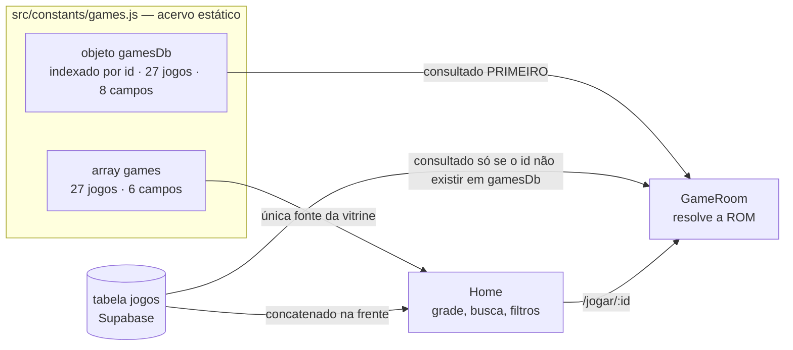
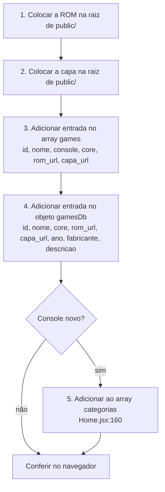
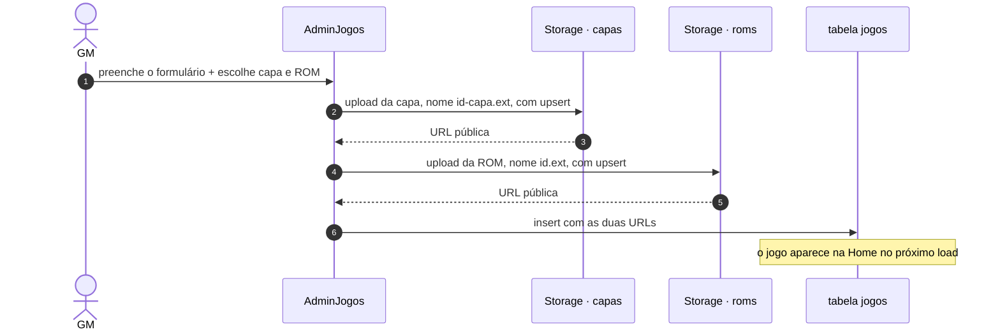
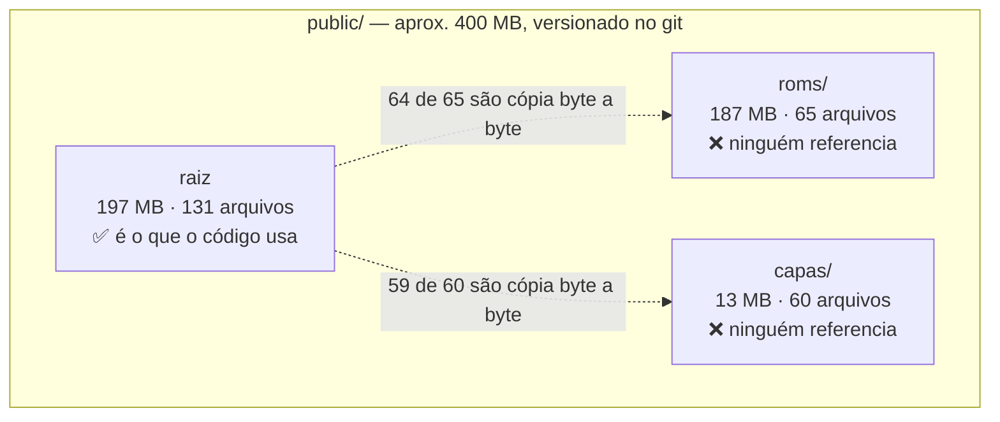
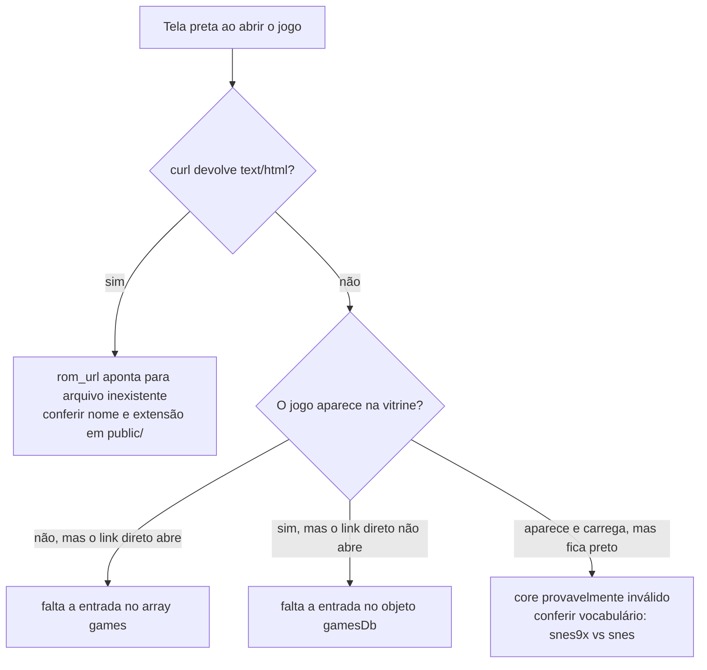

# Catálogo de jogos — como funciona e como mexer

Guia operacional do acervo. Cadastrar um jogo é a tarefa mais frequente do projeto e a que mais dá errado em silêncio, porque o catálogo tem **três fontes que nunca se sincronizam** e **dois caminhos de cadastro com convenções diferentes**.

- [1. As três fontes do catálogo](#1-as-três-fontes-do-catálogo)
- [2. O contrato de um jogo](#2-o-contrato-de-um-jogo)
- [3. Consoles, cores e extensões](#3-consoles-cores-e-extensões)
- [4. Adicionar um jogo pelo código](#4-adicionar-um-jogo-pelo-código)
- [5. Adicionar um jogo pelo painel](#5-adicionar-um-jogo-pelo-painel)
- [6. Onde ficam os binários](#6-onde-ficam-os-binários)
- [7. Como o acervo está hoje](#7-como-o-acervo-está-hoje)
- [8. Diagnóstico de "o jogo não abre"](#8-diagnóstico-de-o-jogo-não-abre)

---

## 1. As três fontes do catálogo



As três fontes têm papéis diferentes e **precedências opostas**, e é daí que vêm os problemas:

| | Home | GameRoom |
| --- | --- | --- |
| Fonte lida | `games[]` + tabela `jogos` | `gamesDb{}` e, se não achar, tabela `jogos` |
| Precedência | banco **na frente** do estático | estático **antes** do banco |
| Referência | [`Home.jsx:64`](../src/pages/Home.jsx#L64) | [`GameRoom.jsx:185-196`](../src/pages/GameRoom.jsx#L185-L196) |

> ⚠️ **A armadilha:** cadastrar pelo painel um `id` que já existe em `gamesDb` faz a vitrine mostrar a versão do banco e o emulador rodar a versão estática. São dados diferentes na mesma tela.

E dentro do próprio arquivo estático, as duas estruturas são consumidas por telas diferentes:

- A **Home** só lê `games[]` — [`Home.jsx:16`](../src/pages/Home.jsx#L16) e [`:30`](../src/pages/Home.jsx#L30)
- A **GameRoom** só lê `gamesDb{}` — [`GameRoom.jsx:19`](../src/pages/GameRoom.jsx#L19) e [`:185`](../src/pages/GameRoom.jsx#L185)

Editar só uma delas produz um jogo que **aparece na vitrine e não abre**, ou que **abre por link direto e não aparece na vitrine**.

## 2. O contrato de um jogo

As duas estruturas guardam os mesmos jogos com campos diferentes:

| Campo | `games[]` | `gamesDb{}` | Para que serve |
| --- | :---: | :---: | --- |
| `id` | ✅ | ✅ | chave da URL `/jogar/:id` |
| `nome` | ✅ | ✅ | título no card e na sala de jogo |
| `console` | ✅ | ❌ | **só** o filtro por categoria da Home |
| `core` | ✅ | ✅ | qual emulador carregar |
| `rom_url` | ✅ | ✅ | o binário |
| `capa_url` | ✅ | ✅ | imagem do card |
| `ano` | ❌ | ✅ | ficha técnica na sala de jogo |
| `fabricante` | ❌ | ✅ | ficha técnica na sala de jogo |
| `descricao` | ❌ | ✅ | texto na sala de jogo |

Do jogo resolvido, **apenas `rom_url` e `core` chegam ao emulador** ([`GameRoom.jsx:320`](../src/pages/GameRoom.jsx#L320)). Todo o resto é apresentação.

## 3. Consoles, cores e extensões

O que o acervo estático usa hoje:

| Console | `core` em `games.js` | Extensões | Jogos | Válido? |
| --- | --- | --- | :---: | :---: |
| SNES | `snes9x` | `.sfc` `.smc` | 18 | ✅ |
| MASTER SYSTEM | `smsplus` | `.sms` | 2 | ✅ |
| NES | `nestopia` | `.nes` | 2 | ✅ |
| GBA | `mgba` | `.gba` | 2 | ✅ |
| GAME BOY | `gambatte` | `.gbc` | 1 | ✅ |
| NINTENDO 64 | `mupen64plus_next` | `.z64` | 1 | ✅ |
| ATARI | `stella` | `.a26` | 1 | ❌ **não existe** |

### As duas convenções de `core` — e qual está certa

`window.EJS_core` aceita **duas famílias de nome**, e o projeto usa uma em cada caminho de cadastro:

| Caminho | Vocabulário | Exemplos |
| --- | --- | --- |
| `games.js` (código) | **nome do core** | `snes9x`, `mgba`, `genesis_plus_gx` |
| `<select>` do painel | **nome do sistema** | `snes`, `gba`, `segaMD` |

As duas funcionam, porque o EmulatorJS mantém um mapa de sistema → cores. Trecho do mapa oficial (`data/src/consts.js`):

```js
"snes":      ["snes9x", "bsnes"]
"segaMD":    ["genesis_plus_gx", "genesis_plus_gx_wide", "picodrive"]
"atari2600": ["stella2014"]
```

> ❌ **`stella` não é nem sistema nem core.** O core do Atari 2600 chama-se `stella2014`. O CDN responde `404` para `stella-wasm.data` e `200` para `stella2014-wasm.data`, em todas as versões testadas. Como Asteroids é o único jogo de Atari do acervo, **o console inteiro está morto** — a correção é um caractere: `stella` → `stella2014` em [`games.js:229`](../src/constants/games.js#L229) e [`:512`](../src/constants/games.js#L512).

O sintoma de um `core` inválido é **tela preta sem nenhum erro visível** — o emulador simplesmente não inicia. Ao inventar um valor de `core`, confira antes contra o mapa oficial.

## 4. Adicionar um jogo pelo código



Os quatro primeiros passos são **obrigatórios**. Pular o passo 3 ou o 4 é o erro mais comum.

**Passo 3** — em [`src/constants/games.js`](../src/constants/games.js), no array que começa na linha 1:

```js
{
  id: 'snes-meu-jogo',
  nome: 'Meu Jogo',
  console: 'SNES',
  core: 'snes9x',
  rom_url: '/meu-jogo.sfc',
  capa_url: '/meu-jogo.jpg',
},
```

**Passo 4** — no objeto que começa na linha 235, com a chave **igual ao `id`**:

```js
'snes-meu-jogo': {
  id: 'snes-meu-jogo',
  rom_url: '/meu-jogo.sfc',
  core: 'snes9x',
  nome: 'Meu Jogo',
  ano: '1994',
  fabricante: 'Capcom',
  capa_url: '/meu-jogo.jpg',
  descricao: 'Uma frase sobre o jogo.',
},
```

**Passo 5** — o valor de `console` precisa bater **exatamente** com um item do array `categorias` em [`Home.jsx:160-171`](../src/pages/Home.jsx#L160-L171), incluindo maiúsculas. O filtro é comparação literal ([`Home.jsx:181`](../src/pages/Home.jsx#L181)): `'Mega Drive'` não bate com `'MEGA DRIVE'`.

## 5. Adicionar um jogo pelo painel

Rota `/painel-admin-jogos`. Aqui os arquivos **não vão para `public/`** — vão para o Supabase Storage.



Diferenças que importam em relação ao caminho pelo código:

| | Pelo código | Pelo painel |
| --- | --- | --- |
| Onde o binário fica | `public/`, versionado no git | Supabase Storage, bucket `roms` |
| Origem servida ao emulador | mesmo domínio | domínio do Supabase |
| Vocabulário de `core` | `snes9x`, `mgba`, … | `snes`, `gba`, … |
| Campo `console` | valor fixo escolhido por você | **texto livre**, sem `select` |
| Precisa de deploy | sim | não, é imediato |
| Aparece na GameRoom | sempre | **só se o `id` não existir em `gamesDb`** |

> ⚠️ **`upsert: true` nos dois uploads** ([`AdminJogos.jsx:41`](../src/pages/AdminJogos.jsx#L41) e [`:52`](../src/pages/AdminJogos.jsx#L52)): recadastrar o mesmo `id` sobrescreve os arquivos anteriores sem aviso.
>
> ⚠️ **Apagar um jogo não apaga os arquivos.** [`AdminGerenciarJogos.jsx:41`](../src/pages/AdminGerenciarJogos.jsx#L41) remove só a linha da tabela; a ROM e a capa continuam ocupando espaço nos buckets, sem nada apontando para elas.

## 6. Onde ficam os binários



**Só a raiz de `public/` é usada.** As subpastas `roms/` e `capas/` não são referenciadas por nenhuma linha de código — são cerca de **200 MB de cópias exatas** que viajam no clone e no deploy.

Coloque arquivo novo sempre na **raiz** de `public/`.

## 7. Como o acervo está hoje

O acervo tem duas metades independentes, e as duas têm problemas diferentes.

### Acervo estático — `src/constants/games.js`

| Medida | Valor |
| --- | --- |
| Jogos cadastrados | 27 |
| **Jogos que efetivamente abrem** | **22** |
| Arquivos em `public/` | 256 |
| Peso total de `public/` | ~397 MB |
| Peso do que o catálogo realmente usa | ~66 MB |
| Arquivos na raiz sem entrada no catálogo | 83 (~133 MB) |
| Duplicação pura nas subpastas | ~200 MB |

### Acervo do banco — tabela `jogos`

| Medida | Valor |
| --- | --- |
| Jogos cadastrados | 133 |
| **Jogos que não iniciam** | **49 (37%)** |
| — com `rom_url` apontando para um **PNG** | 29 |
| — com `core` incompatível com a extensão | 20 |

Os 29 casos de PNG têm todos o mesmo padrão: o nome-base do arquivo é idêntico ao da capa, ou seja **a imagem da capa foi selecionada no campo da ROM** no formulário de cadastro. O emulador recebe ~220 KB de PNG onde esperava a ROM.

Os outros 20 têm ROM válida e `core` errado — ROM de SNES com core `nes`, ROM de GBA com core `snes`, `.swc` mandado para o core de GBA.

> O rodapé da Home anuncia o total de linhas carregadas ([`Home.jsx:888`](../src/pages/Home.jsx#L888)), não o total de jogos que abrem. O número exibido é otimista.

### Os quatro jogos quebrados do acervo estático

O `rom_url` aponta para um arquivo que não existe:

| Jogo | Catálogo pede | Existe em `public/` |
| --- | --- | --- |
| Batman Forever | `/batman-forever.sfc` | `batman-forever.md` |
| Battletoads | `/battletoads.sfc` | `battletoads.md` |
| Battletoads & Double Dragon | `/battletoads-double-dragon.sfc` | `battletoads-double-dragon.md` |
| Super Mario 64 | `/Super_Mario_64.z64` | `mario64.z64` |

Os três primeiros estão cadastrados como SNES com core `snes9x`, mas os arquivos no disco são ROMs de Mega Drive — o cabeçalho traz `SEGA GENESIS` / `SEGA MEGA DRIVE` no offset `0x100`. Ou seja, **o console e o core também estão errados**, não só o nome do arquivo.

**Um quinto jogo não abre por outro motivo:** Asteroids, por causa do core `stella` inexistente (ver seção 3). Total: **22 dos 27 abrem**.

**Três capas quebradas:** `/sonicthehedgehog.jpg`, `/dkc.jpg` (existe `dkc.png`) e `/supermarioworld.jpg`. As três existem apenas em `gamesDb`, então o defeito aparece na barra "jogos relacionados" da sala de jogo, não na grade da Home.

### ⚠️ Todas as 22 ROMs de Mega Drive em `public/` estão corrompidas

Não adianta apenas corrigir os nomes: **os arquivos `.md` da raiz de `public/` estão inutilizáveis**. Foram re-encodados como texto UTF-8 em algum ponto do histórico, e todo byte `>= 0x80` virou a sequência `EF BF BD` (o caractere de substituição U+FFFD).

| Sintoma | Verificação |
| --- | --- |
| Tamanho não é potência de 2 | `battletoads.md` tem 870.194 bytes; uma ROM real teria 512 KB ou 1 MB |
| Tamanho inflado 1,6× a 2× | `batman-forever.md` tem 8,3 MB para um cartucho de 4 MB |
| Contagem de `EF BF BD` | de 148 mil a 2 milhões de ocorrências por arquivo — **em todos os 22** |
| Cabeçalho destruído | offset 0 de `battletoads.md` é `00 EF BF BD EF BF BD…` no lugar do vetor de stack do 68000 |

As ROMs SEGA em **outros** formatos estão intactas — `.smd` e `.bin` têm zero ocorrências de `EF BF BD` e tamanho correto. A corrupção atingiu especificamente a extensão `.md`.

Para reativar o Mega Drive é preciso **substituir os binários**, não renomeá-los.

**O filtro MEGA DRIVE não tem nenhum jogo no acervo estático.** A categoria existe em [`Home.jsx:165`](../src/pages/Home.jsx#L165) mas nenhum dos 27 jogos tem esse `console` — enquanto 22 ROMs de Mega Drive ocupam espaço em `public/` sem entrada no catálogo, todas corrompidas. Os jogos de Mega Drive que aparecem na Home vêm da tabela `jogos` do Supabase.

## 8. Diagnóstico de "o jogo não abre"

O ponto mais importante: **nada retorna 404 neste projeto**. O rewrite do [`vercel.json`](../vercel.json) faz qualquer arquivo inexistente responder `200` com o HTML da SPA. O emulador recebe HTML no lugar da ROM e mostra tela preta, sem erro.

Confira o `content-type`, nunca o status:

```bash
curl -o /dev/null -w '%{http_code} %{content_type} %{size_download}\n' \
  http://localhost:5173/meu-jogo.sfc
```

| Resultado | Significado |
| --- | --- |
| `200 text/html 3461` | ❌ **o arquivo não existe** — é o fallback da SPA |
| `200 application/octet-stream 1310720` | ✅ a ROM está lá |

Roteiro rápido:



---

*Ver também [README.md](../README.md) e [ARQUITETURA.md](ARQUITETURA.md).*
