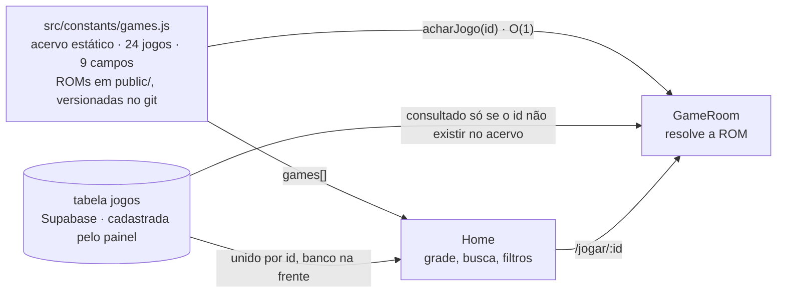
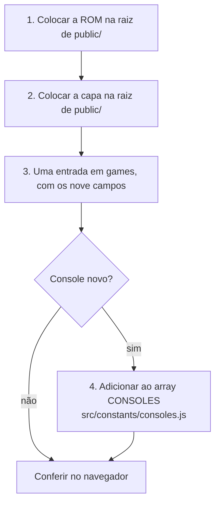
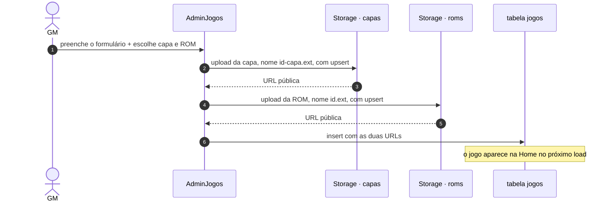
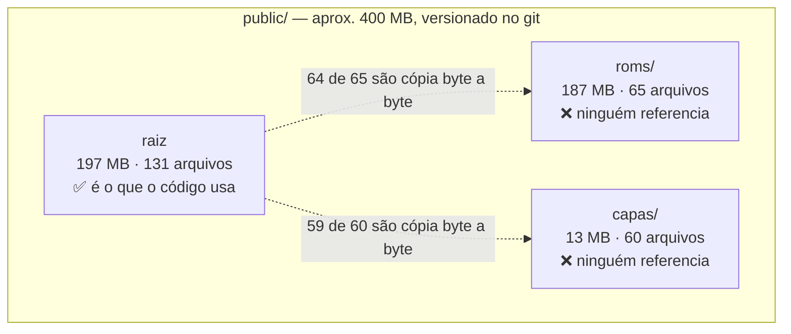
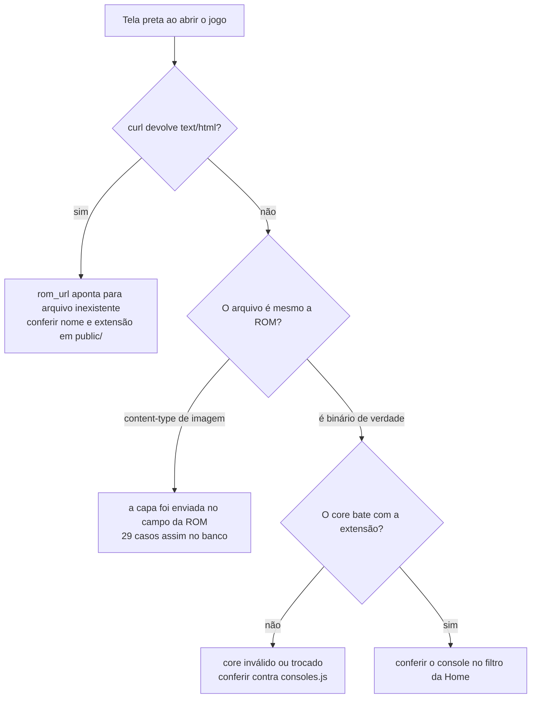

# Catálogo de jogos — como funciona e como mexer

Guia operacional do acervo. Cadastrar um jogo é a tarefa mais frequente do projeto e a que mais dá errado em silêncio, porque o catálogo tem **três fontes que nunca se sincronizam** e **dois caminhos de cadastro com convenções diferentes**.

- [1. As duas fontes do catálogo](#1-as-duas-fontes-do-catálogo)
- [2. O contrato de um jogo](#2-o-contrato-de-um-jogo)
- [3. Consoles, cores e extensões](#3-consoles-cores-e-extensões)
- [4. Adicionar um jogo pelo código](#4-adicionar-um-jogo-pelo-código)
- [5. Adicionar um jogo pelo painel](#5-adicionar-um-jogo-pelo-painel)
- [6. Onde ficam os binários](#6-onde-ficam-os-binários)
- [7. Como o acervo está hoje](#7-como-o-acervo-está-hoje)
- [8. Diagnóstico de "o jogo não abre"](#8-diagnóstico-de-o-jogo-não-abre)

---

## 1. As duas fontes do catálogo



O acervo estático é **uma estrutura só**. Antes eram duas — um array lido pela
vitrine e um objeto lido pela sala de jogo — e editar uma sem a outra produzia
um jogo que aparecia na vitrine e não abria, ou que abria por link direto e não
aparecia na vitrine. Hoje o arquivo exporta:

| Exportação | O que é | Quem usa |
| --- | --- | --- |
| `games` | o array, na ordem de exibição | [`useCatalogo`](../src/hooks/useCatalogo.js), [`gerar-sitemap.mjs`](../scripts/gerar-sitemap.mjs) |
| `acharJogo(id)` | busca por id em O(1), sobre um índice montado uma vez | [`GameRoom`](../src/pages/GameRoom.jsx) |
| `outrosJogos(id)` | todos menos um, para os relacionados | [`GameRoom`](../src/pages/GameRoom.jsx) |

O que **continua** valendo é a precedência oposta entre as duas telas:

| | Home | GameRoom |
| --- | --- | --- |
| Fonte lida | `games` + tabela `jogos` | acervo estático e, se não achar, tabela `jogos` |
| Precedência | banco **na frente** do estático | estático **antes** do banco |
| Referência | [`useCatalogo.js:8-14`](../src/hooks/useCatalogo.js#L8-L14) | [`GameRoom.jsx:185-207`](../src/pages/GameRoom.jsx#L185-L207) |

> ⚠️ **A armadilha que sobrou:** cadastrar pelo painel um `id` que já existe no
> acervo estático faz a vitrine mostrar a versão do banco e o emulador rodar a
> versão do código. São dados diferentes na mesma tela. Use identificadores que
> não colidam.

## 2. O contrato de um jogo

Toda entrada tem os **nove campos**, todos obrigatórios:

| Campo | Para que serve |
| --- | --- |
| `id` | chave da URL `/jogar/:id` |
| `nome` | título no card e na sala de jogo |
| `console` | filtro por categoria da Home — precisa existir em [`consoles.js`](../src/constants/consoles.js) |
| `core` | qual emulador carregar |
| `rom_url` | o binário |
| `capa_url` | imagem do card |
| `ano` | ficha técnica na sala de jogo |
| `fabricante` | ficha técnica na sala de jogo |
| `descricao` | texto na sala de jogo |

Do jogo resolvido, **apenas `rom_url` e `core` chegam ao emulador**. Todo o
resto é apresentação.

## 3. Consoles, cores e extensões

O que o acervo estático usa hoje:

| Console | `core` em `games.js` | Extensões | Jogos | Válido? |
| --- | --- | --- | :---: | :---: |
| SNES | `snes9x` | `.sfc` `.smc` | 18 | ✅ |
| MASTER SYSTEM | `smsplus` | `.sms` | 2 | ✅ |
| NES | `nestopia` | `.nes` | 2 | ✅ |
| GBA | `mgba` | `.gba` | 2 | ✅ |
| GAME BOY | `gambatte` | `.gbc` | 1 | ✅ |
| NINTENDO 64 | `mupen64plus_next` | `.z64` | 1 | ✅ |
| ATARI | `stella` | `.a26` | 1 | ❌ **não existe** |

### As duas convenções de `core` — e qual está certa

`window.EJS_core` aceita **duas famílias de nome**, e o projeto usa uma em cada caminho de cadastro:

| Caminho | Vocabulário | Exemplos |
| --- | --- | --- |
| `games.js` (código) | **nome do core** | `snes9x`, `mgba`, `genesis_plus_gx` |
| `<select>` do painel | **nome do sistema** | `snes`, `gba`, `segaMD` |

As duas funcionam, porque o EmulatorJS mantém um mapa de sistema → cores. Trecho do mapa oficial (`data/src/consts.js`):

```js
"snes":      ["snes9x", "bsnes"]
"segaMD":    ["genesis_plus_gx", "genesis_plus_gx_wide", "picodrive"]
"atari2600": ["stella2014"]
```

> ❌ **`stella` não é nem sistema nem core.** O core do Atari 2600 chama-se `stella2014`. O CDN responde `404` para `stella-wasm.data` e `200` para `stella2014-wasm.data`, em todas as versões testadas. Como Asteroids é o único jogo de Atari do acervo, **o console inteiro está morto** — a correção é um caractere: `stella` → `stella2014` em [`games.js:229`](../src/constants/games.js#L229) e [`:512`](../src/constants/games.js#L512).

O sintoma de um `core` inválido é **tela preta sem nenhum erro visível** — o emulador simplesmente não inicia. Ao inventar um valor de `core`, confira antes contra o mapa oficial.

## 4. Adicionar um jogo pelo código



**Passo 3** — em [`src/constants/games.js`](../src/constants/games.js), dentro do
bloco do console correspondente:

```js
{
  id: 'snes-meu-jogo',
  nome: 'Meu Jogo',
  console: 'SNES',
  core: 'snes9x',
  rom_url: '/meu-jogo.sfc',
  capa_url: '/meu-jogo.webp',
  ano: '1994',
  fabricante: 'Capcom',
  descricao: 'Uma frase sobre o jogo.',
},
```

É **uma** edição só. Antes eram duas, num array e num objeto separados, e
esquecer a segunda era o erro mais comum do repositório.

**Passo 4** — o valor de `console` precisa existir como `valor` em
[`src/constants/consoles.js`](../src/constants/consoles.js), que é a fonte única
do que o site suporta: dela saem tanto os filtros da vitrine quanto a lista do
formulário de cadastro.

A comparação **não é mais literal**: [`normalizarConsole`](../src/constants/consoles.js)
tira acento, espaço sobrando e caixa antes de comparar, e ainda resolve
sinônimos, então `'Super Nintendo'`, `'super nintendo'` e `'SNES'` caem todos na
mesma categoria. Foi essa comparação literal que deixou 67 jogos do banco
invisíveis em qualquer filtro.

Um valor desconhecido não vira `null`: continua aparecendo em "Todos", só não
ganha filtro próprio.

## 5. Adicionar um jogo pelo painel

Rota `/painel-admin-jogos`. Aqui os arquivos **não vão para `public/`** — vão para o Supabase Storage.



Diferenças que importam em relação ao caminho pelo código:

| | Pelo código | Pelo painel |
| --- | --- | --- |
| Onde o binário fica | `public/`, versionado no git | Supabase Storage, bucket `roms` |
| Origem servida ao emulador | mesmo domínio | domínio do Supabase |
| Campo `console` | escrito à mão na entrada | escolhido num `select` fechado |
| Campo `core` | escrito à mão na entrada | **derivado** do console escolhido |
| Extensão da ROM | por sua conta | validada contra o console antes de subir |
| Precisa de deploy | sim | não, é imediato |
| Aparece na GameRoom | sempre | **só se o `id` não existir no acervo estático** |

Os dois caminhos usam hoje o **mesmo vocabulário de `core`** — o nome do núcleo
do EmulatorJS, como `snes9x` e `mgba` — porque o formulário deriva o core de
[`consoles.js`](../src/constants/consoles.js) em vez de aceitar texto livre. Era
essa divergência que gravava 55 jogos como `'Super Nintendo'`, valor que nenhum
filtro reconhecia, e 20 jogos com core incompatível com a extensão da ROM.

> ⚠️ **`upsert: true` nos dois uploads** ([`AdminJogos.jsx:41`](../src/pages/AdminJogos.jsx#L41) e [`:52`](../src/pages/AdminJogos.jsx#L52)): recadastrar o mesmo `id` sobrescreve os arquivos anteriores sem aviso.
>
> ⚠️ **Apagar um jogo não apaga os arquivos.** [`AdminGerenciarJogos.jsx:41`](../src/pages/AdminGerenciarJogos.jsx#L41) remove só a linha da tabela; a ROM e a capa continuam ocupando espaço nos buckets, sem nada apontando para elas.

## 6. Onde ficam os binários



**Só a raiz de `public/` é usada.** As subpastas `roms/` e `capas/` não são referenciadas por nenhuma linha de código — são cerca de **200 MB de cópias exatas** que viajam no clone e no deploy.

Coloque arquivo novo sempre na **raiz** de `public/`.

## 7. Como o acervo está hoje

O acervo tem duas metades independentes, e as duas têm problemas diferentes.

### Acervo estático — `src/constants/games.js`

| Medida | Valor |
| --- | --- |
| Jogos cadastrados | 24 |
| **Jogos que abrem** | **24** |
| Inconsistências entre `console`, `core` e extensão | nenhuma |
| ROMs ou capas locais apontando para arquivo inexistente | nenhuma |
| Arquivos em `public/` | 135 |
| Peso total de `public/` | 196,8 MB |
| Peso do que o catálogo realmente usa | 70,4 MB |
| Arquivos na raiz sem entrada no catálogo | 89 (126,5 MB) |

Distribuição por console:

| Console | Jogos | `core` |
| --- | :---: | --- |
| Super Nintendo | 15 | `snes9x` |
| Master System | 2 | `smsplus` |
| Nintendo (NES) | 2 | `nestopia` |
| Game Boy Advance | 2 | `mgba` |
| Game Boy / Color | 1 | `gambatte` |
| Nintendo 64 | 1 | `mupen64plus_next` |
| Atari 2600 | 1 | `stella2014` |
| Mega Drive | **0** | `genesis_plus_gx` |

Duas capas ainda são carregadas de fora do domínio, da Wikipédia:
`sms-sonic` e `snes-supermarioworld`.

### Acervo do banco — tabela `jogos`

| Medida | Valor |
| --- | --- |
| Jogos cadastrados | 133 |
| **Jogos que não iniciam** | **47 (35%)** |
| — com `rom_url` apontando para uma **imagem** | 29 |
| — com `core` incompatível com a extensão | 18 |

Os 29 casos de imagem têm todos o mesmo padrão: o nome-base do arquivo é
idêntico ao da capa, ou seja **a imagem da capa foi selecionada no campo da
ROM** no formulário de cadastro. O emulador recebe um PNG onde esperava a ROM.

Os outros 18 têm ROM válida e `core` errado — ROM de SNES com core `nes`, ROM
de GBA com core `snes`, `.swc` mandado para o core de GBA. Outros 2 usam cores
fora do mapa conferido, `neogeo` e `gbc`, e não entram nessa conta.

> Os dois caminhos de entrada desse lixo já estão fechados: o formulário de
> cadastro valida a extensão contra o console e deriva o `core`, em vez de
> aceitar texto livre. O que está no banco de antes continua lá.

### A coluna `console` está suja, mas não esconde mais ninguém

A coluna tem **10 grafias distintas** para 8 consoles, incluindo erros de
digitação:

| Grafia | Registros |
| --- | :---: |
| `Super Nintendo` | 55 |
| `MEGA DRIVE` | 33 |
| `GAME BOY` | 19 |
| `SNES` | 12 |
| `Game Boy` | 8 |
| `GBA` | 2 |
| `Nintendo` · `Super Nitendo` · `Game boy` · `game Boy` | 1 cada |

Isso **já foi neutralizado no cliente**: [`normalizarConsole`](../src/constants/consoles.js)
tira acento, caixa e espaço e resolve sinônimos antes de comparar. Medido contra
a tabela real, **133 de 133 registros caem num filtro** — inclusive os quatro
com grafia errada. Limpar a coluna no banco continua valendo, mas hoje é
arrumação, não correção de bug.

### ⚠️ As 22 ROMs de Mega Drive em `public/` estão corrompidas

**O filtro Mega Drive não tem nenhum jogo no acervo estático**, e é por isso: os
binários existem, mas não servem. Foram re-encodados como texto UTF-8 em algum
ponto do histórico, e todo byte `>= 0x80` virou a sequência `EF BF BD`, o
caractere de substituição U+FFFD.

| Sintoma | Verificação |
| --- | --- |
| Tamanho não é potência de 2 | `battletoads.md` tem 870.194 bytes; uma ROM real teria 512 KB ou 1 MB |
| Tamanho inflado 1,6× a 2× | `batman-forever.md` tem 8,3 MB para um cartucho de 4 MB |
| Contagem de `EF BF BD` | de 148 mil a 2 milhões de ocorrências por arquivo — **em todos os 22** |
| Cabeçalho destruído | offset 0 de `battletoads.md` é `00 EF BF BD EF BF BD…` no lugar do vetor de stack do 68000 |

As ROMs SEGA em **outros** formatos estão intactas — `.smd` e `.bin` têm zero
ocorrências de `EF BF BD` e tamanho correto. A corrupção atingiu especificamente
a extensão `.md`.

Para reativar o Mega Drive é preciso **substituir os binários**, não
renomeá-los. Enquanto isso não acontece, os jogos de Mega Drive que aparecem na
Home vêm todos da tabela `jogos` do Supabase.

## 8. Diagnóstico de "o jogo não abre"

O ponto mais importante: **nada retorna 404 neste projeto**. O rewrite do [`vercel.json`](../vercel.json) faz qualquer arquivo inexistente responder `200` com o HTML da SPA. O emulador recebe HTML no lugar da ROM e mostra tela preta, sem erro.

Confira o `content-type`, nunca o status:

```bash
curl -o /dev/null -w '%{http_code} %{content_type} %{size_download}\n' \
  http://localhost:5173/meu-jogo.sfc
```

| Resultado | Significado |
| --- | --- |
| `200 text/html 3461` | ❌ **o arquivo não existe** — é o fallback da SPA |
| `200 application/octet-stream 1310720` | ✅ a ROM está lá |

Roteiro rápido:



Um jogo do acervo estático não some mais da vitrine nem deixa de abrir por
descuido de cadastro: a entrada é uma só, e a vitrine e a sala de jogo leem a
mesma. Se o jogo aparece num lugar e não no outro, ele vem da tabela `jogos`.

Para conferir o acervo inteiro de uma vez, sem abrir o navegador:

```bash
node --input-type=module -e "
  import { games } from './src/constants/games.js';
  for (const j of games) {
    const r = await fetch('http://localhost:5173' + j.rom_url);
    const tipo = r.headers.get('content-type');
    if (tipo?.includes('text/html')) console.log('FALTA', j.id, j.rom_url);
  }
  console.log('conferidos', games.length);
"
```

---

*Ver também [README.md](../README.md) e [ARQUITETURA.md](ARQUITETURA.md).*
