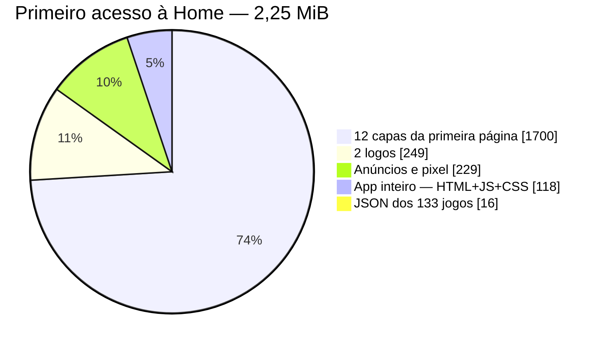
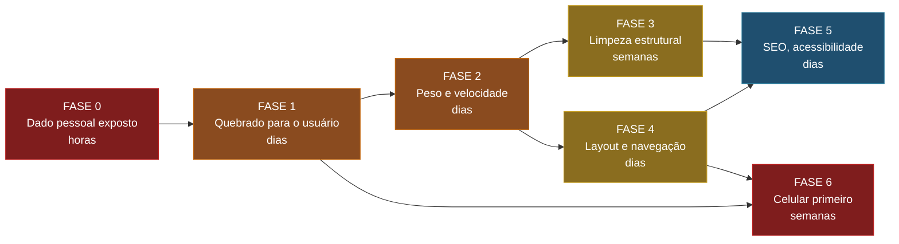
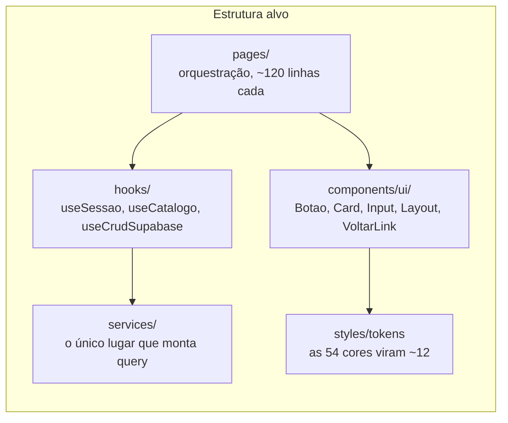

# Roadmap — Primeira limpeza do Sopra Fitas

Levantamento técnico completo do estado do projeto, com o que precisa ser corrigido, em que ordem e por quê.

**Método:** cada item foi verificado empiricamente — comando executado, resposta HTTP medida, arquivo lido, bytes contados. Nada aqui é impressão. Onde a conclusão depende de configuração fora do repositório (painel do Supabase, da Vercel, do Google Ad Manager), isso está dito explicitamente em vez de assumido.

**Números levantados:** 93 constatações verificadas, 78 confirmadas, 11 derrubadas na conferência, 4 dependentes de checagem externa, mais 35 achados novos que a varredura inicial não tinha pego.

- [Progresso](#progresso)
- [Sumário executivo](#sumário-executivo)
- [Ordem de execução](#ordem-de-execução)
- [Fase 0 — Urgente: dado pessoal exposto](#fase-0--urgente-dado-pessoal-exposto)
- [Fase 1 — O que está quebrado para o usuário](#fase-1--o-que-está-quebrado-para-o-usuário)
- [Fase 2 — Peso e velocidade](#fase-2--peso-e-velocidade)
- [Fase 3 — Limpeza estrutural do código](#fase-3--limpeza-estrutural-do-código)
- [Fase 4 — Layout e navegação](#fase-4--layout-e-navegação)
- [Fase 5 — Higiene: SEO, acessibilidade e qualidade](#fase-5--higiene-seo-acessibilidade-e-qualidade)
- [Fase 6 — Celular primeiro](#fase-6--celular-primeiro)
- [Avaliado e descartado](#avaliado-e-descartado)
- [Depende de checagem fora do repositório](#depende-de-checagem-fora-do-repositório)

---

## Progresso

82 de 120 tarefas concluídas. As caixas são marcadas conforme cada item entra em produção.

| Fase | Frente | Prioridade | Progresso | Feitas |
| :---: | --- | --- | --- | :---: |
| **0** | Dado pessoal exposto | Urgente | `███░░░░░░░` | 2/6 |
| **1** | Quebrado para o usuário | Alta | `████████░░` | 20/25 |
| **2** | Peso e velocidade | Alta | `████████░░` | 8/10 |
| **3** | Limpeza estrutural | Média | `██████████` | 23/23 |
| **4** | Layout e navegação | Média | `██████░░░░` | 7/12 |
| **5** | SEO, acessibilidade e qualidade | Baixa | `█████████░` | 18/19 |
| **6** | Celular primeiro | **Urgente** | `██░░░░░░░░` | 4/25 |
| | **Total** | | `███████░░░` | **82/120** |

---

## Sumário executivo

Cinco números que resumem o estado do produto:

| | Hoje | Depois da limpeza |
| --- | --- | --- |
| **Peso do primeiro acesso** | 2,25 MiB · ~47 s em 3G lenta | 0,66 MiB · ~14 s *(−70%)* |
| **Jogos que realmente abrem** | ~106 de 160 anunciados | 160 de 160 |
| **Catálogo visível nos filtros** | 93 de 160 *(42% invisível)* | 160 de 160 |
| **Salvar / carregar progresso** | **nunca funcionou** | funcionando |
| **Peso do repositório** | 397 MiB, sendo 199 MiB duplicata pura | ~198 MiB |

Três leituras que importam para a decisão:

**O site em si não é o problema — o conteúdo é.** O aplicativo inteiro (HTML + JS + CSS, já comprimido) pesa **118 KB**. Os outros 2,13 MiB do primeiro acesso são imagens mal dimensionadas e scripts de terceiros. Dá para cortar 70% do tempo de carregamento **sem tocar em uma linha de lógica**, só tratando imagem.

**A maior parte do catálogo está morta ou escondida.** O rodapé anuncia 160 jogos. Cerca de 54 não iniciam e 67 não aparecem em nenhum filtro de console. Nenhum desses casos é bug de código difícil: são dados errados no banco, cadastrados por um formulário que aceita qualquer coisa.

**A complexidade está concentrada, não espalhada.** Das 190 funções do projeto, **96,8% têm complexidade ciclomática ≤ 9** — perfeitamente saudável. O problema são dois componentes-deus (`Home` com 33, `GameRoom` com 24) que concentram tudo. Isso é uma boa notícia: não é reescrita, é quebrar dois arquivos.

### De onde vêm os 2,25 MiB do primeiro acesso



## Ordem de execução

As fases estão ordenadas por retorno sobre esforço. A Fase 3 é a única que exige refatoração de verdade; todas as outras são correções pontuais.



A Fase 3 vem depois da 1 e da 2 de propósito: refatorar código que ainda tem bug conhecido é retrabalho garantido, e o ganho de performance da Fase 2 não depende de arquitetura nenhuma.

---

## Fase 0 — Urgente: dado pessoal exposto

**Dois itens. Não são refatoração — são configuração de permissão no painel do Supabase.** Devem ser tratados antes de qualquer outra coisa do roadmap, inclusive antes de abrir uma branch.

### 0.1 — E-mail dos 184 usuários legível por qualquer visitante

[`Ranking.jsx:32-36`](../src/pages/Ranking.jsx#L32-L36) faz `select('id, nome, email, pontos')` — o e-mail trafega para o navegador mesmo sem a tela exibi-lo. Com a chave anônima que está no bundle público dá para paginar a tabela e extrair a base inteira: a verificação retornou **184 registros**, com e-mail completo.

Risco de LGPD e lista pronta para phishing.

A correção tem **duas camadas, ambas necessárias**: remover `email` do `select` resolve a tela, mas não fecha o buraco — a chave anônima permite consultar a coluna diretamente. É preciso também restringir o `SELECT` em `profiles` por RLS e expor o ranking por uma *view* pública com apenas `id`, `nome` e `pontos`.

**Tarefas**

- [x] Remover `email` do `select` em [`Ranking.jsx:34`](../src/pages/Ranking.jsx#L34)
- [ ] Restringir o `SELECT` em `profiles` por RLS ao próprio usuário
- [ ] Criar view pública de ranking expondo só `id`, `nome` e `pontos`

### 0.2 — Prints dos jogadores listáveis, com o autor identificável

O bucket `prints` responde a listagem com a chave anônima. Como o arquivo é nomeado `{user_id}_{timestamp}` ([`GameRoom.jsx:152`](../src/pages/GameRoom.jsx#L152)), cada print fica amarrado ao `profiles.id` do autor — e `profiles` devolve nome e e-mail. Na verificação, **todos os prints existentes foram associados a contas reais**.

Print de tela costuma capturar notificação de celular, nick e conversa.

Correção: tirar a permissão de listagem do papel anônimo, tornar o bucket privado servindo ao GM por URL assinada, e parar de usar o `user.id` como nome de arquivo — usar um identificador aleatório e guardar a associação só na tabela `missoes`.

---

**Tarefas**

- [ ] Remover a permissão de listagem anônima do bucket `prints` — **depende de acesso**
- [ ] Tornar o bucket privado e servir ao GM por URL assinada — **depende de acesso**
- [x] Trocar o nome do arquivo de print por identificador aleatório
  <br>Esta era a única das três que estava no código, e não no painel. O print
  sobe com `crypto.randomUUID()` no lugar de `{user_id}_{timestamp}`; quem
  guarda de quem é o print passa a ser só a coluna `user_id` da tabela
  `missoes`. Isso corta a correlação para os envios novos — os que já estão no
  bucket continuam nomeados pelo id antigo, e só saem de lá pelas outras duas.

## Fase 1 — O que está quebrado para o usuário

### 1.1 — Salvar, Carregar e Reiniciar nunca funcionaram

**Criticidade máxima.** [`Emulator.jsx:36`](../src/components/Emulator.jsx#L36) define `window.EJS_player = '#game'` — uma **string** com o seletor CSS. O emulador de verdade é criado pelo loader em `window.EJS_emulator`, que o código nunca referencia.

Como string não-vazia é *truthy*, o `if (window.EJS_player)` de [`GameRoom.jsx:88-96`](../src/pages/GameRoom.jsx#L88-L96) passa e a chamada seguinte lança `TypeError`. Sem `try/catch`, o botão falha em silêncio.

O jogador clica em Salvar, não recebe retorno nenhum, volta depois e perdeu tudo. Num Chrono Trigger ou Harvest Moon isso são horas de progresso. **A funcionalidade que a tela de login anuncia como "salve seus jogos na nuvem" não existe em nenhuma linha do projeto.**

O mesmo defeito explica outro sintoma: em `finalizarEmulador` os guards `typeof … === 'function'` são sempre falsos, então `stop()` e `destroy()` nunca executam. O emulador nunca é encerrado — sair pelo botão "voltar" do navegador ou clicar num jogo relacionado deixa a música tocando por baixo do site. É por isso que o botão Sair precisa recarregar a página inteira: o reload virou o único jeito de matar o áudio.

> Corrigir isto destrava trocar `window.location.href` por navegação SPA, que hoje refaz todo o download de anúncios e do catálogo a cada saída de jogo.

**Tarefas**

- [x] Guardar a instância real do emulador (`window.EJS_emulator`) numa ref
- [x] Fazer Salvar, Carregar e Reiniciar chamarem a instância, com retorno visual
- [x] Encerrar o emulador de verdade no cleanup do componente
- [x] Trocar `window.location.href` por `navigate('/')` no botão Sair

### 1.2 — 54 dos 160 jogos não iniciam

| Origem | Quantidade | Causa |
| --- | :---: | --- |
| Banco — `rom_url` aponta para um **PNG** | 29 | a capa foi selecionada no campo da ROM no cadastro |
| Banco — `core` incompatível com a extensão | 20 | ROM de SNES com core `nes`, ROM de GBA com core `snes` |
| Estático — arquivo inexistente | 4 | Batman Forever, Battletoads, Battletoads & DD, Super Mario 64 |
| Estático — core inexistente | 1 | Asteroids: o core é `stella2014`, não `stella` |

Os 29 casos de PNG têm todos o mesmo padrão — o nome-base do arquivo é idêntico ao da capa. O formulário aceitou uma imagem no campo da ROM sem reclamar.

Correções, em ordem de custo:

- **Asteroids:** trocar `stella` por `stella2014` em duas linhas. Ressuscita o único jogo de Atari do site.
- **Super Mario 64:** o `rom_url` pede `/Super_Mario_64.z64`, o arquivo é `/mario64.z64`. A ROM está íntegra e o core está certo — é uma linha, e ressuscita o único jogo de N64.
- **Os 49 do banco:** um `UPDATE` corrigindo `rom_url` e `core`, mais validação no formulário. O `core` deveria ser **derivado da extensão**, não escolhido à mão.
- **Os 3 da SEGA:** ver 1.3, não é só renomear.

**Tarefas**

- [x] Asteroids: core `stella` → `stella2014`
- [x] Super Mario 64: `rom_url` → `/mario64.z64`
- [ ] Corrigir os 29 jogos com `rom_url` apontando para PNG
- [ ] Corrigir os 20 jogos com `core` incompatível com a extensão
- [x] Validar tipo e extensão do arquivo no formulário de cadastro
- [x] Derivar o `core` do console escolhido em vez de deixá-lo livre

### 1.3 — As 22 ROMs de Mega Drive em `public/` estão corrompidas

Batman Forever, Battletoads e Battletoads & Double Dragon estão cadastrados como SNES, mas os arquivos no disco são de Mega Drive — o cabeçalho traz `SEGA GENESIS` no offset `0x100`. Só que **renomear não resolve**: todos os 22 arquivos `.md` da raiz de `public/` foram re-encodados como texto UTF-8 em algum ponto do histórico, e todo byte `>= 0x80` virou a sequência `EF BF BD`.

| Verificação | Resultado |
| --- | --- |
| Ocorrências de `EF BF BD` por arquivo | de 148 mil a 2 milhões — **em todos os 22** |
| Tamanho | inflado 1,6× a 2×, nenhum é potência de 2 |
| Cabeçalho | destruído: `battletoads.md` começa com `00 EF BF BD EF BF BD…` |
| Controle: ROMs SEGA em `.smd` e `.bin` | **zero** ocorrências, tamanho correto |

A corrupção atingiu especificamente a extensão `.md`. **Os binários precisam ser substituídos por cópias íntegras.** Enquanto não houver, o certo é tirar os três cards do ar em vez de deixá-los quebrados.

**Tarefas**

- [ ] Substituir as 22 ROMs `.md` por cópias íntegras
- [x] Enquanto não houver ROM válida, remover do catálogo os 3 cards da SEGA

### 1.4 — 67 dos 160 jogos não aparecem em nenhum filtro

O filtro compara texto exato ([`Home.jsx:181`](../src/pages/Home.jsx#L181)) e a coluna `console` do banco é **texto livre**, com default `'Super Nintendo'` — valor que não existe na lista de categorias da Home.

Distribuição real da coluna no banco:

```text
MEGA DRIVE 33 · GAME BOY 19 · SNES 12 · GBA 2
Super Nintendo 55  ← invisível
Game Boy 8 · Nintendo 1 · Super Nitendo 1 · Game boy 1 · game Boy 1  ← invisíveis
```

**42% do catálogo só aparece em "Todos".** Inclui um erro de digitação gravado no banco (`Super Nitendo`).

Correção em duas frentes: normalizar a coluna com um `UPDATE`, e trocar o campo de texto livre do formulário por um `<select>` fechado — senão o problema volta a cada cadastro.

**Tarefas**

- [x] Normalizar o valor de console na comparação do filtro
- [ ] `UPDATE` normalizando a coluna `console` na tabela `jogos`
- [x] Trocar o campo de texto livre por `<select>` fechado no cadastro
- [ ] Definir a que console pertence o registro gravado como `Nintendo`

### 1.5 — Falhas que deixam o usuário preso

| Problema | Onde | Efeito |
| --- | --- | --- |
| Nenhuma rota 404 | [`App.jsx:22-58`](../src/App.jsx#L22-L58) | qualquer URL errada renderiza página **totalmente vazia** |
| GameRoom sem estado de erro | [`GameRoom.jsx:186-201`](../src/pages/GameRoom.jsx#L186-L201) | "Carregando jogo…" eterno, sem link de saída |
| "Enviar Print" oferecido a quem está deslogado | [`GameRoom.jsx:472`](../src/pages/GameRoom.jsx#L472) | só falha no final, depois de escolher o arquivo |
| Desfavoritar prende numa página vazia | `Home.jsx` | a paginação não reseta e os botões somem |
| Busca não ignora acento | `Home.jsx` | digitar "pokemon" retorna zero jogos |
| Erro no Ranking vira "Ninguém pontuou ainda" | `Ranking.jsx` | falha de rede parece estado vazio |
| Sem recuperação de senha | `Login.jsx` | quem esquece a senha **perde a conta e os pontos** |
| `/loja` sem nenhum link no site | `App.jsx:32` | a loja de afiliados é inalcançável navegando |
| Jogador nunca sabe o que houve com a missão | `GameRoom.jsx` / `AdminMissoes.jsx` | não existe tela de status |

**Tarefas**

- [x] Adicionar rota de 404
- [x] Dar estado de erro à sala de jogo, com link de saída
- [x] Exigir login antes de abrir o modal de envio de print
- [x] Limitar a página atual ao total válido, para desfavoritar não esvaziar a tela
- [x] Fazer a busca ignorar acentos
- [x] Distinguir erro de estado vazio no Ranking
- [x] Implementar recuperação de senha
  <br>Duas pontas: "Esqueci minha senha" na tela de login pede o e-mail, e
  `/nova-senha` recebe o link e troca a senha. A resposta é a mesma para e-mail
  cadastrado e não cadastrado, de propósito — responder "essa conta não existe"
  transformaria a tela num confirmador de quem tem conta aqui.
  <br>⚠️ Falta o painel: `/nova-senha` precisa entrar na lista de
  redirecionamentos do Auth. Fora dela o Supabase ignora o endereço e manda o
  link para a Site URL, e a tela nunca abre.
- [x] Criar tela de acompanhamento das missões enviadas
  <br>`/minhas-missoes`, ligada ao perfil e citada no aviso de envio. Mostra o
  print, o jogo, a data e a situação. A situação é comparada pelo radical
  (`aprovad`, `rejeitad`) porque quem grava esse valor é a função
  `aprovar_missao_gm`, que mora no banco e não neste repositório — chutar entre
  'aprovado' e 'aprovada' faria a tela esconder envio que existe.

### 1.6 — O CDN do emulador já está quebrado

[`Emulator.jsx:39`](../src/components/Emulator.jsx#L39) aponta para o branch `@main` de um repositório de terceiros, num caminho que **não contém os arquivos do emulador**. O `emulator.min.js` responde 404 e o loader cai num fallback que o próprio EmulatorJS registra no console como *"THIS METHOD IS A FAILSAFE, AND NOT OFFICIALLY SUPPORTED"*.

Resultado por jogo aberto: **16 idas ao CDN em vez de 1**, incluindo um 404 puro, carregando a versão não-minificada.

Correção: apontar para o CDN oficial com versão fixada — `https://cdn.emulatorjs.org/4.2.3/data/`, onde o build minificado existe. Resolve os 404, reduz o peso e congela a versão, eliminando o risco de um commit de terceiro derrubar todos os jogos sem aviso.

---

**Tarefas**

- [x] Apontar o EmulatorJS para o CDN oficial em versão fixa

## Fase 2 — Peso e velocidade

### 2.1 — Imagens: o maior ganho do roadmap inteiro

84,6% do primeiro acesso são imagens. As capas têm em média 204 KiB e são exibidas numa caixa de 160px de altura. A maior tem **763 KiB e 1426×2000 px**.

| Ação | Ganho medido |
| --- | --- |
| Converter as 60 capas para WebP 400×320 q80 | 12,55 MB → **1,61 MB** (−87,2%) |
| Adicionar `loading="lazy"` e `decoding="async"` | 8 dos 12 cards da página 1 ficam abaixo da dobra no mobile |
| Dar `height`/`aspect-ratio` ao logo | elimina o salto de layout na entrada |

**Correção da estimativa.** Este número supunha reprocessar todas as capas, mas a medição mostrou que **as capas da primeira página vêm do Supabase Storage**, não de `public/` — só os logos e as 22 capas do catálogo estático estão ao nosso alcance pelo código.

Medido antes e depois, no viewport de celular:

| | Antes | Depois |
| --- | ---: | ---: |
| Capas (Supabase) | 1.696 KB | **828 KB** |
| Imagens locais | 249 KB | **66 KB** |
| Anúncios e pixel | 786 KB | 785 KB |
| Outros | 53 KB | 53 KB |
| **Total sem o app** | **2.784 KB** | **1.732 KB** *(−38%)* |

Metade do ganho nas capas veio do carregamento tardio, que funciona independente de onde a imagem esteja hospedada. Reprocessar as capas do Supabase levaria os 828 KB para perto de 150 KB, e continua valendo — mas depende de acesso ao painel.

**Tarefas**

- [x] Converter para WebP as 22 capas locais do catálogo estático
- [ ] Converter as capas hospedadas no Supabase Storage — **depende de acesso**
- [x] Adicionar `loading="lazy"` e `decoding="async"` nos cards
- [x] Dar dimensão fixa ao logo da Home

### 2.2 — Cache: hoje não existe

Medido em produção, não suposto:

```bash
$ curl -sI https://assoprafitas.com/assets/index-CEGMpbNX.js
cache-control: public, max-age=0, must-revalidate
```

**Todo arquivo do site** é servido com `max-age=0` — inclusive os assets que já têm hash de conteúdo no nome e nunca mudam. Um visitante recorrente paga cerca de **55 idas ao servidor** só para revalidar coisas que já tem em cache.

Correção: adicionar um bloco `headers` no [`vercel.json`](../vercel.json) com `max-age=31536000, immutable` para `/assets/*` (é seguro, os nomes têm hash), cache semanal para capas e ROMs, e manter `max-age=0` apenas para o `index.html`.

**Tarefas**

- [x] Adicionar bloco `headers` no `vercel.json` com cache imutável para `/assets/*`
- [x] Definir cache semanal para capas e ROMs

### 2.3 — 199 MiB de duplicata pura no repositório

`public/roms/` e `public/capas/` são cópias byte a byte do que já está na raiz de `public/`, e **nenhuma linha de código as referencia** — nem o fonte, nem o bundle gerado.

| Medida | Valor |
| --- | --- |
| Arquivos duplicados idênticos | 123 |
| Desperdício | **198,71 MiB** |
| Par com mesmo nome e conteúdo diferente | 1 — `logo.jpg` (a versão usada é a da raiz) |

Além disso, 83% de `public/` (332 MB) são ROMs e capas órfãs, incluindo jogos inteiros que nunca aparecem no site.

Isso não afeta a navegação — o navegador nunca baixa as duplicatas. Afeta **build, deploy e clone**: hoje o repositório é inviável de clonar em rede fraca.

**Tarefas**

- [x] Remover `public/roms/` e `public/capas/`
- [ ] Decidir o destino das ROMs e capas órfãs

### 2.4 — Bundle e divisão de código

O bundle é um chunk único de 486 KB (136 KB gzip). Composição medida:

| Parte | Peso | % |
| --- | --- | :---: |
| react + react-dom | 197,7 KB | 41,6% |
| @supabase/supabase-js | 159,1 KB | 33,5% |
| código da aplicação | 81,8 KB | 17,2% |
| react-router-dom | 27,5 KB | 5,8% |
| lucide-react | 8,8 KB | 1,8% |

O ganho aqui é menor do que parece à primeira vista (ver [Avaliado e descartado](#avaliado-e-descartado)), mas vale por **higiene de cache**: separar React, Router e Supabase em chunks próprios faz o código da aplicação — que muda toda semana — parar de invalidar os 62 KB do React a cada deploy.

---

**Tarefas**

- [x] Separar react, router e supabase em chunks próprios
- [x] Envolver as rotas admin em `React.lazy`

## Fase 3 — Limpeza estrutural do código

Esta é a fase que o time vai sentir no dia a dia. Todas as medições abaixo saíram de ferramenta — ESLint configurado com as regras de métrica, e um detector de clones com tokenização e janela deslizante.

### 3.1 — A complexidade está concentrada em dois arquivos

| Componente | Complexidade ciclomática | Linhas na função |
| --- | :---: | :---: |
| `Home` | **33** | **874** |
| `GameRoom` | **24** | **655** |
| `Login` | 10 | 298 |
| demais 187 funções | ≤ 9 | — |

Distribuição das 190 funções do projeto: **96,8% têm complexidade ≤ 9**. Apenas duas passam de 10.

Isso muda a conversa. O código não está "todo ruim": ele tem dois componentes-deus e um monte de folha simples. `Home` sozinho acumula sessão, perfil, ranking, missões, catálogo, favoritos, busca, filtro, paginação, responsividade, sorteio e toda a renderização — numa única função de 874 linhas.

**Alvo:** extrair hooks (`useSessao`, `useCatalogo`, `useFavoritos`, `usePaginacao`) e componentes de apresentação, deixando `Home` e `GameRoom` como orquestradores de ~120 linhas.

**Tarefas**

- [x] Extrair hooks da Home: sessão, catálogo, favoritos e paginação
- [x] Extrair os componentes de apresentação da Home
- [x] Extrair hooks e componentes da sala de jogo
  <br>De 772 linhas no começo para 160. Saíram três hooks — `useJogo`,
  `useRelacionados` e `useEmulador` — e quatro componentes em
  `components/jogo/`. A extração revelou dois defeitos que estavam
  escondidos: o sorteio rodava dentro de um `useMemo`, ou seja durante o
  render, onde o React não garante quantas vezes executa; e o jogo do
  acervo do código era gravado com `setState` num efeito, custando um
  render a mais para um dado que já estava em memória.
- [x] Tirar `gerarNumerosPagina` do componente como função pura

### 3.2 — Duplicação: 23% do projeto, 48% das telas de admin

Medido com três janelas de tokens, para não depender de um único critério:

| Escopo | Janela 30 | Janela 50 | Janela 80 *(conservadora)* |
| --- | :---: | :---: | :---: |
| Telas de admin (1.668 linhas) | 48,4% | **23,6%** | 6,3% |
| Projeto inteiro (4.488 linhas) | — | **22,7%** | — |

Piores arquivos: `Perfil.jsx` 41,4% · `AdminJogos.jsx` 38,4% · `AdminUsuarios.jsx` 35,8%.

O que mais chama atenção é a **ausência total de reuso** — não é código copiado e mantido igual, é código copiado e divergido:

| Componente conceitual | Ocorrências | Variantes distintas |
| --- | :---: | :---: |
| Botão primário amarelo | 8 | **8** — nenhuma cópia igual a outra |
| Card escuro | 23 | 20 — **7 tons** de "superfície escura" |
| Link de voltar | 11 | 8 — 3 tamanhos de ícone diferentes |
| Casca de página | 11 | 8 — 4 fundos, 3 grafias de `fontFamily` |
| Input | 10 | 9 |

E **379 cores hexadecimais escritas à mão**, 54 valores distintos. O [`index.css`](../src/index.css) já declara variáveis CSS — e o uso de `var(--…)` nos arquivos `.jsx` é **zero**.

**Tarefas**

- [x] Criar `components/ui` com Botão, Card, Input, Layout e link de voltar
- [x] Criar tokens de cor e substituir as 379 cores escritas à mão
- [x] Migrar as telas para os componentes compartilhados
  <br>11 das 12 telas usam `components/ui`. A Home é a exceção de propósito:
  busca, filtros e paginação dela são peças próprias, já extraídas para
  `components/home`.

### 3.3 — A duplicação já custa dinheiro, medido

Dois números que provam a consequência prática em vez de apontar o cheiro:

**53% dos erros de lint são dois defeitos multiplicados por copy-paste.** Dos 19 achados do ESLint, 7 são o mesmo bloco `useEffect(() => { fetchX() }, [])` copiado em cinco arquivos, e 3 são a mesma destruturação inútil dentro do bloco de upload copiado duas vezes. Não são 19 problemas: são 2, colados 10 vezes. Cada correção hoje precisa ser feita cinco vezes.

**A duplicação de dados já esteve causando bug em produção.** Os jogos do catálogo estático viviam em duas estruturas (`games[]` e `gamesDb{}`), com 5 campos duplicados por jogo. **Quatro chegaram a divergir:**

| Jogo | Divergência |
| --- | --- |
| Sonic (Master System) | capa aponta para a Wikipédia numa estrutura e para `/sonicthehedgehog.jpg` na outra |
| Contra III | `'Contra III'` × `'Contra III: The Alien Wars'` |
| Donkey Kong Country | `/dkc.png` × `/dkc.jpg` |
| Super Mario World | Wikipédia × `/supermarioworld.jpg` |

Como a Home lia uma estrutura e a sala de jogo lia a outra, **a capa e o nome mudavam entre a listagem e a tela do jogo, no ar**.

✅ **Resolvido.** O arquivo passou a ter uma entrada por jogo, com os nove campos, e exporta `games` para a vitrine e `acharJogo(id)` para a sala de jogo, sobre um índice montado uma vez. Adicionar um jogo virou uma edição em vez de duas.

**Tarefas**

- [x] Unificar `games[]` e `gamesDb{}` numa fonte única
- [x] Corrigir as 4 divergências que já existem entre as duas

### 3.4 — Nenhuma camada entre a tela e o banco

| Medida | Valor |
| --- | --- |
| Páginas que importam `supabaseClient` direto | **13 de 13 (100%)** |
| Chamadas ao Supabase espalhadas nos componentes | 51 |
| Arquivos de serviço, repositório ou hook de dados | **0** |
| Handlers com a forma idêntica `fetch → setState` | 17, somando 241 linhas |

Operadores de query encadeados dentro do JSX: 19 `.select(`, 16 `.eq(`, 9 `.order(`, 6 `.update(`, 4 `.insert(`. A tela monta SQL.

Consequência direta: os três blocos de upload (`AdminJogos`, `AdminLoja`, `GameRoom`) repetem a mesma sequência — `split('.').pop()` → montar caminho → `upload(..., {upsert:true})` → `getPublicUrl` → gravar na tabela — e **os três têm zero validação de tipo ou tamanho de arquivo**. Foi assim que 29 capas PNG entraram no campo da ROM.

**Tarefas**

- [x] Criar `services/` como único lugar que monta consulta
- [x] Unificar os 3 blocos de upload, com validação de tipo e tamanho
- [x] Criar um guard de rota único para as telas administrativas

### 3.5 — Responsividade: duas implementações que discordam

| Medida | Valor |
| --- | --- |
| Media queries no projeto | **0** |
| Páginas que tratam responsividade | 2 de 13 |
| Implementações independentes de "é mobile?" | 2, com regras diferentes |

`GameRoom` usa `innerWidth < 768 || innerHeight < 600`; `Home` usa `screenWidth <= 768`. **Numa janela de exatamente 768px, a Home considera mobile e a GameRoom considera desktop.** As sete telas de admin não tratam responsividade nenhuma e usam padding fixo de 40px.

Toda a responsividade do produto é ternário JavaScript dentro de objeto de estilo inline, reavaliado a cada evento de resize.

**Tarefas**

- [x] Unificar a detecção de breakpoint entre Home e sala de jogo
- [x] Migrar a responsividade de JavaScript para CSS
  <br>Sobrou um uso de breakpoint em JavaScript, e de propósito: quantos números
  a paginação mostra, 5 no celular e 7 no desktop. Isso é conteúdo, não
  aparência — a lista de botões muda, não o estilo deles.

### 3.6 — Estruturas de dados e complexidade algorítmica

Cada item abaixo foi conferido por três ângulos diferentes — rigor algorítmico, adequação do princípio de design invocado e exequibilidade da correção — com o objetivo explícito de **derrubar a alegação**. Onde o enunciado original exagerava, ele foi corrigido; os números abaixo são os que sobraram.

**O que vale corrigir, e por quê de verdade:**

| Onde | Defeito | Por que consertar |
| --- | --- | --- |
| `[...data, ...games]` em [`Home.jsx:64`](../src/pages/Home.jsx#L64) | união de conjuntos feita com concatenação — **sem deduplicar por `id`** | **já produz bug visível:** "Super Mario World" aparece duas vezes na Home, e o React recebe `key` duplicada |
| `outrosJogos.sort()` em [`GameRoom.jsx:139`](../src/pages/GameRoom.jsx#L139) | `.sort()` é *in-place* e **muta o array do state**; `() => 0.5 - Math.random()` é embaralhamento enviesado | o viés é **posicional** e medido: índice 0 sai em 17,8% dos sorteios, índice 16 em 4,7%. Ordenação usada para amostragem é a ferramenta errada — Fisher-Yates parcial é O(k) em vez de O(n log n) |
| `getStats` em [`AdminDashboard.jsx:49-62`](../src/pages/AdminDashboard.jsx#L49-L62) | três consultas independentes com `await` em série | `Promise.all` leva a latência de `3·RTT` para `max(RTT)`. Nenhuma depende da outra. Correção trivial |
| Upload em [`AdminJogos.jsx:36-56`](../src/pages/AdminJogos.jsx#L36-L56) | capa e ROM sobem em série, sendo independentes | economiza um RTT de handshake. **Só depois de validar o `id`** — paralelizar antes disso agrava o problema de ROM órfã |
| `handleResize` em [`Home.jsx:46-51`](../src/pages/Home.jsx#L46-L51) | guarda a **largura bruta** no estado, mas só usa dois booleanos derivados | re-render a cada quadro do gesto. Onde realmente morde é no **mobile**, onde `resize` dispara quando a barra de URL aparece e some durante a rolagem |
| `key={idx}` em [`Home.jsx:443`](../src/pages/Home.jsx#L443) e [`:650`](../src/pages/Home.jsx#L650) | chave posicional em listas que **reordenam** (ranking por pontos, missões por data) | identidade de elemento errada na reconciliação. As duas listas têm chave natural disponível |
| Filtro de [`AdminGerenciarJogos.jsx:49-52`](../src/pages/AdminGerenciarJogos.jsx#L49-L52) | `j.nome.toLowerCase()` **sem guarda de nulo** | um jogo com `nome` NULL derruba a tela. O `?? ''` é o conserto — dois minutos |
| `select('*')` em [`Home.jsx:60`](../src/pages/Home.jsx#L60) | traz a tabela inteira para exibir 12 cards | enxugar as colunas paga sozinho e é uma linha |

**A calibração honesta — o que NÃO vender como ganho de performance:**

A conferência derrubou a retórica de três itens, e isso importa mais do que parece: levar número inflado para uma reunião é como o argumento inteiro perde credibilidade.

- **`favoritos` como Array em vez de `Set`.** Medido no tamanho real: **0,874 µs contra 0,381 µs**. Chamar isso de "o trecho quadrático do projeto" é dramatização — com 27 jogos e no máximo 27 favoritos, a diferença é imperceptível. A troca continua certa, mas o argumento é **semântico** (um conjunto deve ser modelado como conjunto), não de velocidade.
- **`useMemo` no `jogosFiltrados`.** Medido: **1,84 µs por render**, ordens de grandeza abaixo do custo de reconciliar os 12 cards que estão na tela. Recomendar `useMemo` aqui é otimização sem alvo. O que paga sozinho é apenas içar o `busca.toLowerCase()` para fora do predicado — uma linha.
- **`Object.values(gamesDb).filter()` a cada troca de jogo.** Eram ~2 µs e dois arrays pequenos, uma vez por navegação, ao lado de uma requisição de rede na mesma função. **Nunca foi uma tarefa** — saiu de graça junto com a unificação do `games.js`, que trocou a varredura do objeto por `outrosJogos(id)`.

**Item derrubado na conferência:** trocar o *refetch* da tabela após uma edição por atualização otimista. O veredito foi que hoje isso seria **trocar correção por microtimização** — quatro caminhos de escrita não reportam erro e os `update` não usam `.select()`, então a tela mostraria uma alteração que pode não ter acontecido no banco. Só faz sentido depois que o tratamento de erro existir.

> Resumo para a reunião: **o site não está lento por causa de algoritmo.** Está lento por causa das imagens da Fase 2. O que a Fase 3 entrega é código que escala e que para de produzir bug — três dos itens acima já causam defeito visível hoje.

**Tarefas**

- [x] Içar `busca.toLowerCase()` para fora do predicado do filtro
- [x] Deduplicar por `id` a união dos catálogos
- [x] Corrigir o sorteio de relacionados: copiar antes e usar Fisher-Yates
- [x] Paralelizar as três consultas do painel administrativo
- [x] Paralelizar os uploads de capa e ROM, depois de validar o id
- [x] Guardar o booleano de breakpoint em vez da largura em pixels
- [x] Trocar `key={idx}` por chave natural nas duas listas que reordenam
- [x] Adicionar guarda de nulo no filtro do admin
- [x] Enxugar as colunas do `select` da Home

### 3.7 — Alvo estrutural



**Primeiro passo, o que destrava o resto:** extrair `components/ui` e os tokens de cor. É mecânico, tem risco baixo de regressão, elimina as 8 variantes de botão e as 20 de card, e passa a dar um lugar óbvio para tudo que vier depois.

**Sobre TypeScript:** o projeto já tem `@types/react` instalado e é todo JavaScript. A recomendação é **não** migrar nesta primeira limpeza — o ganho não paga o custo enquanto os dois componentes-deus existirem. Reavaliar depois da 3.1.

---

## Fase 4 — Layout e navegação

> ⛔ Tudo que envolve **posição, tamanho ou comportamento de anúncio** está marcado como
> fora do nosso escopo: é decisão de quem cuida da monetização, não da equipe de código.

| Item | Medição | Correção |
| --- | --- | --- |
| Vãos mortos de anúncio | primeiro jogo a **1.750px** do topo no mobile; ~1.650px também em 768, 844 e 1024px | não reservar 250px fixos quando o slot não preenche |
| Ordem no mobile | logo → busca → filtros → **anúncio → desafios → anúncio → top 5** → jogos | subir a grade de jogos |
| Header quase vazio | só o botão ENTRAR e um `<div/>` de 0×0 | logo e navegação no topo |
| GameRoom desperdiça 600px | dois `<aside>` de "Publicidade" vazios no desktop | recolher quando não há criativo |
| GameRoom em 390×844 | termina com **690px** de "Publicidade" vazia no rodapé | idem |
| Criativo transborda a coluna | iframe de 300px numa coluna de 260px | ajustar a coluna |
| Capas cortadas | `objectFit: cover` corta de **20% a 34%** da arte | padronizar proporção |
| Grade com órfãos | `minmax(160px)` com 12 itens deixa a última linha incompleta em 1440px | ajustar itens por página ao número de colunas |
| Filtros em 4 linhas no mobile | 9 botões quebrando | faixa única com rolagem horizontal |
| Card de desafios | `maxHeight: 260` corta o texto no meio da frase | indicar rolagem |
| Estado da vitrine não vai para a URL | voltar de um jogo devolve para a página 1 | busca, filtro e página na *query string* |
| IDs de anúncio repetidos entre rotas | mesmos IDs na Home e na GameRoom; após navegação SPA o slot não reexibe | IDs distintos por rota |

**Tarefas**

- [x] Colocar a grade de jogos na coluna do meio no desktop, entre os Desafios e o Top 5
- [ ] ⛔ **Fora do meu escopo** — Não reservar 250px fixos quando o slot de anúncio não preenche
- [ ] ⛔ **Fora do meu escopo** — Subir a grade de jogos na ordem visual do celular (mexe na posição dos anúncios)
- [x] Colocar logo e navegação no cabeçalho fixo
- [ ] ⛔ **Fora do meu escopo** — Recolher os painéis de publicidade da sala de jogo quando não há criativo
- [ ] ⛔ **Fora do meu escopo** — Ajustar a largura da coluna para o criativo de 300px não transbordar
- [x] Padronizar a proporção das capas para não cortar a arte
  <br>Resolvido com `object-fit: contain` em vez de padronizar os arquivos: as
  22 capas locais têm 14 proporções diferentes, de 0,71 a 2,00, e recortar
  comia 27% da arte em média e 48% no pior caso.
- [x] Ajustar itens por página ao número de colunas da grade — 4 colunas × 3 linhas = 12
- [x] Transformar os filtros em faixa única com rolagem horizontal no celular
  <br>De 4 linhas e 170,8px para 1 linha e 43px. O primeiro jogo subiu 128px.
- [x] Indicar rolagem no card de desafios
  <br>Feito com a contagem no cabeçalho, não com sombra de rolagem: medi o
  brilho da borda da lista e a sombra em CSS não produzia diferença
  perceptível, porque cada desafio tem fundo próprio e a barra é sobreposta.
  O teto da lista também deixou de ser 260px fixos.
- [x] Levar busca, filtro e página para a URL
  <br>O campo de busca precisou de estado próprio e escrita atrasada na URL:
  controlado direto pela URL ele perdia letra, e digitar "mario" depressa
  gravava "mo".
- [ ] ⛔ **Fora do meu escopo** — Usar IDs de anúncio distintos por rota

## Fase 5 — Higiene: SEO, acessibilidade e qualidade

**SEO** — não existem `robots.txt` nem `sitemap.xml`; o `index.html` não tem nenhuma tag `og:`, `twitter:` ou `canonical`; e o `<title>` é fixo em todas as rotas. Colar o link no WhatsApp não gera prévia nenhuma.

**Acessibilidade** — 13 botões só de ícone sem nome acessível (o leitor de tela anuncia apenas "botão"); **55 elementos clicáveis com menos de 44px** (o coração de favoritar tem 28×31px); zero regras de `:focus` no projeto e 8 inputs com `outline: none`, incluindo e-mail e senha do login; contraste reprovado em `#666` e `#555` (piores casos **2,24:1** e **2,67:1**, contra o mínimo de 4,5:1); nenhum input tem `label` associada nem `autoComplete`; a Home não tem nenhum `<h1>`.

**Qualidade** — `npm run lint` não passa em checkout limpo (17 erros, 2 avisos); 24 `alert()` nativos como feedback de UI em 9 páginas; `animate-spin` usada em 6 lugares e nunca definida, então todos os indicadores de carregamento estão parados; a fonte Inter é referenciada em 12 arquivos e nunca carregada; componentes órfãos (`AvisoPrint`, `AnuncioLateral`, `App.css`, `assets/react.svg`); CSS morto; `public/readme.html` é lixo do CoolROM servido publicamente com redirecionamento para um site de ROMs pirata; o `manifest.json` aponta para um `favicon.ico` que não existe.

**Dados** — 120 dos 184 perfis estão com `nome` NULL, porque o cadastro nunca grava um nome; o pódio da Home já mostra `---`. O Meta Pixel dispara `CompleteRegistration` em **todo carregamento de página**, não no cadastro, o que contamina a métrica de conversão. Apagar um jogo deixa a ROM e a capa no Storage — já há 10 ROMs (14,8 MiB) e 11 capas órfãs acumuladas.

---

**Tarefas — SEO**

- [x] Criar `robots.txt` e `sitemap.xml`
- [x] Adicionar tags `og:` e `twitter:` e `canonical`
- [x] Tornar o `<title>` dinâmico por rota

**Tarefas — Acessibilidade**

- [x] Dar nome acessível aos 13 botões só de ícone
- [x] Levar os alvos de toque a 44px — corações e botões JOGAR
  <br>⚠️ Filtros (31px) e paginação (33px) ficaram como estão: passam o mínimo de
  24px do critério AA, e levá-los a 44px somaria ~52px acima da grade no celular,
  agravando justamente a rolagem que a Fase 4 quer reduzir.
- [x] Criar estados de foco visíveis e remover os `outline: none`
- [x] Corrigir o contraste dos cinzas `#666` e `#555`
- [x] Associar rótulo e `autoComplete` aos campos de formulário
- [x] Dar um `<h1>` à Home

**Tarefas — Qualidade**

- [x] Zerar os 17 erros e 2 avisos do lint
  <br>Os dois últimos estavam no `AnuncioLateral`, o componente órfão que fica
  no repositório por decisão de quem cuida da monetização. O `Date.now()` do
  cache buster saiu do render — impuro no render, ele gerava um documento
  diferente a cada renderização, remontando o iframe e recarregando o anúncio
  sozinho. O anúncio em si é o mesmo.
- [x] Substituir os 24 `alert()` por feedback na interface
  <br>Eram 19 no código quando chegou a vez deles. Sobraram os 4 `window.confirm`,
  de propósito: são confirmações de ação destrutiva, e trocá-las por caixa
  própria exige armadilha de foco para não piorar o teclado.
- [x] Definir a animação dos indicadores de carregamento
- [x] Carregar a fonte Inter ou trocar a declaração
  <br>Trocada a declaração. Medindo a largura do texto, `"Inter"` dava o mesmo
  resultado de uma fonte inexistente: ela nunca foi carregada, porque não há
  `@font-face` nem link de fonte no projeto. Quem tinha Inter instalada via
  uma tipografia diferente do resto do público.
- [x] Remover componentes órfãos, CSS morto e `public/readme.html`
  <br>O `readme.html` era um arquivo do CoolROM servido no domínio, com
  redirecionamento automático para um site de ROMs. Saíram também o
  `AvisoPrint`, que ninguém importava, e as classes que sobraram dele.
  O `AnuncioLateral` continua no repositório, órfão, porque os arquivos
  de anúncio estão congelados por decisão de quem cuida da monetização.
- [x] Corrigir o ícone que o `manifest.json` aponta
  <br>Foi além do ícone: o manifest inteiro estava inservível e o site nunca
  foi instalável, porque faltava o service worker que o Chrome exige.
  Ver a seção do PWA no README.

**Tarefas — Dados**

- [x] Passar a gravar o nome no cadastro
  <br>O campo de apelido não existia no formulário: era essa a origem dos 120
  perfis em branco. O nome vai para `raw_user_meta_data` no `signUp` — com
  confirmação de e-mail ligada não há sessão nesse momento, e a linha em
  `profiles` só nasce depois. Quem copia de lá para `profiles` é o `useSessao`,
  no primeiro carregamento com sessão, numa escrita só.
- [ ] Corrigir os 120 perfis já criados sem nome — **depende de acesso**
  <br>Esses não têm nome em `raw_user_meta_data` nenhum para copiar: o campo
  não existia quando eles se cadastraram. Ou entra um `UPDATE` no painel, ou
  eles preenchem sozinhos pelo perfil.
- [x] Disparar o evento de cadastro do pixel só no cadastro
  <br>O `CompleteRegistration` morava no `index.html` e disparava em toda
  página aberta. Agora sai de dentro do fluxo de cadastro, depois de o Supabase
  confirmar que a conta foi criada.
- [x] Apagar os arquivos do Storage junto com o registro
  <br>A capa e a ROM saem depois da linha, e nunca antes: na ordem inversa, um
  delete que falhasse deixaria o jogo no acervo apontando para arquivo que não
  existe mais. A tela diz quando os arquivos ficaram para trás — permissão do
  balde, arquivo hospedado fora — em vez de anunciar uma limpeza que não houve.
  As 10 ROMs e 11 capas já órfãs continuam lá: essas dependem de faxina no
  painel.

## Fase 6 — Celular primeiro

O celular é por onde o público entra, e por isso esta fase vem antes do resto do que sobrou. Todas as medições saíram de um aparelho físico — Redmi 9A, Android 11, Chrome 151, 2 GB de RAM, viewport de 360×700 CSS — dirigido pelo Chrome DevTools Protocol, com o jogo rodando. O critério para dizer que um jogo "roda" é ele **animar**: quadros distintos capturados ao longo do tempo. Existir um `<canvas>` não conta, e essa distinção derrubou meia dúzia de conclusões pelo caminho.

**Um detalhe do aparelho explica boa parte desta fase:** o Redmi 9A é `armeabi-v7a`, e o Chrome nele é **de 32 bits**. O processo renderizador tem cerca de 3 GB de espaço de endereçamento, e é esse teto — não a RAM — que limita quantos jogos abrem por visita.

---

### 6.1 — Os controles são desenhados por cima do jogo

O EmulatorJS monta o gamepad virtual **dentro** do canvas. Medido com o jogo rodando, nos três modos possíveis:

| Modo | Viewport | Canvas do jogo | % da tela | Jogo coberto |
| --- | --- | --- | ---: | ---: |
| Retrato | 360×700 | 326×246 | 31,8% | **45,3%** |
| Paisagem | 772×260 | 283×213 | 30,0% | **54,0%** |
| Paisagem + tela cheia | 800×360 | 800×360 | **100%** | 12,6% |

Os três blocos de controle têm tamanho **fixo** e nunca se adaptam: `ejs_virtualGamepad_left` 125×125, `ejs_virtualGamepad_right` 130×130, `ejs_virtualGamepad_bottom` 124×30. Num canvas de 326×246 eles comem quase metade da imagem; em tela cheia caem na tarja preta ao lado do jogo (d-pad em x=10, botões em x=660) e deixam de atrapalhar.

**Girar o celular sem entrar em tela cheia é a pior das três opções** — 54% do jogo coberto, contra 45,3% em pé. Quem gira esperando melhorar, piora.

Duas descobertas explicam por que quase ninguém chega no modo que funciona:

- **O botão "Tela cheia" fica fora da tela em retrato.** A barra tem 482px de conteúdo em 326px visíveis: 156px escondidos, com `scrollbar-width: none` ([jogo.css:397](../src/styles/jogo.css#L397)) e nenhuma sombra ou seta indicando que rola. Botão a botão: Sair (66×44) ✓, Salvar (78×44) ✓, Carregar (92×44) ✓, Reiniciar (92×44) ✗ cortado, **Tela cheia (102×44) ✗ fora**.
- **`window.EJS_VirtualGamepadSettings` é `undefined`.** O gamepad virtual nunca foi configurado; está tudo no padrão da biblioteca.

Em tela cheia sobram dois estorvos menores: "Modo"/"Start" e "Rápido"/"Lento" ficam no centro-baixo, sobre o jogo, e as bordas dos botões X e A encostam na imagem.

**Tarefas**

- [ ] Levar quem abre um jogo no celular direto para tela cheia, deitado
  <br>É o único dos três modos em que o jogo ocupa a tela toda e os controles saem de cima dele. [`useEmulador.js:61-71`](../src/hooks/useEmulador.js#L61-L71) já tenta `requestFullscreen` + `orientation.lock('landscape')`; falta disparar no momento certo e explicar ao jogador o que aconteceu.
- [ ] Dar afordância de rolagem à barra de controles, ou fazer os 5 botões caberem em 360px
  <br>Enquanto "Tela cheia" estiver fora da tela sem nenhuma pista, o modo jogável continua invisível para quem usa celular.
- [ ] Tirar "Modo", "Start", "Rápido" e "Lento" de cima do jogo em tela cheia
  <br>⚠️ Depende de confirmar na fonte se `EJS_VirtualGamepadSettings` permite reposicionar botão a botão.
- [ ] Dar saída, salvar e carregar dentro da tela cheia
  <br>Só `#tela-do-jogo` entra em fullscreen, então a barra do site some. Hoje o único caminho de volta é o gesto do sistema.
- [ ] Não esconder o envio de print com o celular deitado
  <br>`.sala__abaixo` fica `display: none` em paisagem: somem a ficha do jogo e o botão de missão, que é a única mecânica de pontuação do site.

---

### 6.2 — Três defeitos que impediam jogar, corrigidos

Estavam empilhados, e cada um mascarava o seguinte.

- [x] O emulador voltou a desenhar na tela
  <br>`EJS_startOnLoaded` estava `true` e pulava a tela de início da biblioteca. Sem esse toque não há gesto do usuário, o Chrome mantém o `AudioContext` suspenso pela política de autoplay, e como o laço principal do core Emscripten é movido pelo áudio, o emulador não desenhava **um quadro sequer**. O estado enganava: `started: true`, `paused: false`, canvas de 652×491 — e tela preta. Forçando `resume()` à mão, o logo da SEGA aparecia no mesmo instante.
- [x] Passou a ser possível abrir mais de um jogo por visita
  <br>O `loader.js` do EmulatorJS não tem guarda: toda vez que roda, anexa um `<script>` novo do `emulator.min.js`. Esse arquivo declara classes no topo de um script clássico, então a segunda execução morre com `Identifier 'EJS_STORAGE' has already been declared` — e declaração léxica não some ao remover a tag. Como a navegação do site é SPA e ninguém recarrega a página, **na prática só dava para jogar um jogo por visita**, sem nenhuma mensagem. Medido: o emulador passou a montar em 6 de 6 trocas.
- [x] O jogo parou de sair do lugar dentro da moldura
  <br>A moldura usava `overflow: hidden`, que **cria contêiner de rolagem**. O EmulatorJS enche essa caixa de 246px com 514px de conteúdo (só a barra de menu escondida tem 260px), então qualquer `scrollIntoView` de um descendente — o navegador faz isso sozinho ao focar algo — rolava a caixa em 80,5px: o topo da imagem sumia e sobrava uma tarja preta embaixo. Sem barra de rolagem, não havia gesto que desfizesse. Resolvido com `overflow: clip`, que corta sem criar rolagem.

---

### 6.3 — O limite de jogos por sessão

Não está resolvido, e não é bug do site. Medido depois das correções da 6.2, com o critério de animar:

| # | Jogo | Core | Reserva | Rodou | RAM livre |
| ---: | --- | --- | ---: | :---: | ---: |
| 1 | Sonic 2 | `segaMD` | 512 MB | ✅ | 444 MB |
| 2 | Mario World | `snes` | 128 MB | ✅ | 245 MB |
| 3 | Yu-Gi-Oh | `gba` | 128 MB | ✅ | 322 MB |
| 4 | Sonic 2 | `segaMD` | 512 MB | ❌ | 456 MB |
| 5 | Mario World | `snes` | 128 MB | ✅ | 350 MB |

Dois números matam a hipótese de vazamento no site: **o heap JS fica em 33–36 MB do primeiro ao último jogo**, e o aparelho **nunca ficou sem RAM** — 245 a 456 MB livres em todas as falhas. O erro é `WebAssembly.instantiate(): Out of memory`, que é espaço de endereçamento, não memória.

**O mecanismo, com fonte:** cada core reserva um bloco **contíguo** no `instantiate` e nunca o devolve. Lendo a seção de memória (id 5) dos binários `.wasm` do 4.2.3: `fceumm` (NES), `snes9x` e `mgba` (GBA) pedem **128 MB**; **`genesis_plus_gx` (Mega Drive), `picodrive` e `mupen64plus_next` (N64) pedem 512 MB**. Isso explica por que o limite não é um contador, é soma: 512+128+128 = 768 MB couberam; o Sonic seguinte pediu mais 512 e não coube; o Mario World depois dele pediu 128 e coube.

**Não há saída pelo lado da biblioteca.** O EmulatorJS 4.2.3 é a versão mais recente (julho de 2025) e a instância expõe 96 métodos, nenhum deles `destroy`, `dispose`, `terminate` ou `unload`. O `callEvent('exit')` que o site chama salva a SRAM, para o laço e desmonta o sistema de arquivos — não libera memória.

**A alternativa medida: Nostalgist.js.** Roda os mesmos cores libretro, é MIT e tem `exit()` de verdade (revoga os blobs do WASM e do JS, remove os listeners do Emscripten). Testado no mesmo aparelho, mesma ROM, mesmo critério:

| | EmulatorJS 4.2.3 | Nostalgist 0.21.1 |
| --- | ---: | ---: |
| Mega Drives seguidos que rodaram | **1** | **5** |
| Tempo até pronto, do 2º em diante | ~8 s | **2,3 s** |
| Tempo até o jogo animar | 11–17 s | **3,9 s** |
| Peso da biblioteca | 700 KB | **54 KB** |
| Reserva do core de Mega Drive | 512 MB | **128 MB** |

Duas ressalvas que precisam constar: o 6º jogo **ainda** deu `Out of memory`, então o `exit()` do Nostalgist também não devolve a memória — o ganho vem do core ser quatro vezes menor, não da biblioteca ser melhor nisso. E o **Nostalgist não traz interface**: nada de gamepad virtual, menus ou botões de save state. Trocar significa construir os controles de toque, o que é trabalho de semanas — mas é também a chance de resolver a 6.1, já que o gamepad que hoje cobre 45% do jogo é justamente o que viria a ser substituído.

**Tarefas**

- [ ] Mostrar mensagem própria quando o `instantiate` falhar, com o que fazer
  <br>Hoje o jogador vê "Falha ao iniciar o jogo" em vermelho, que é texto da biblioteca, sem dizer que basta fechar a aba e abrir de novo. É a correção mais barata e não depende de decisão nenhuma.
- [ ] Decidir sobre trocar o EmulatorJS pelo Nostalgist.js
  <br>Quadruplica os jogos por sessão e corta o tempo de abertura em dois terços, ao custo de reescrever os controles de toque e o save state. Decisão de produto, não de código.
- [ ] Evitar o core de 512 MB onde houver equivalente de 128 MB
  <br>⚠️ Suspeita, ainda não medida: `picodrive` também reserva 512 MB, então não serve de troca para Mega Drive dentro do EmulatorJS.

---

### 6.4 — Velocidade de abertura

- [x] Anúncios e medição saíram do caminho crítico
  <br>GTM, `gpt.js` e Meta Pixel passaram a esperar o emulador montar, com teto de tempo para nunca deixarem de carregar. Nenhum anúncio foi removido e o slot continua preenchendo — conferido 14 s depois: `googletag` ativo, `dataLayer` populado, `fbq` presente e iframe de 250px no slot.

| Tempo até o botão de iniciar aparecer | Antes | Depois |
| --- | ---: | ---: |
| Cache frio | 7.352 ms | **2.218 ms** |
| Cache quente | 5.565 ms | **1.625 ms** |

Composição das 92 requisições da página de jogo, antes da mudança: site 11 req · CDN do emulador 8 · ROM 2 · Supabase 7 · **anúncios e medição 57 req e 88 KB**, ou seja 62% das requisições e 94% dos bytes.

O que sobra é o próprio emulador: depois de tocar em iniciar, ainda são **cerca de 8 segundos** até o primeiro quadro. É o download de 1,15 MB de core comprimido em 7z mais a descompactação **em JavaScript** (`extract7z.js`, 274 KB) num processador de 32 bits.

**Tarefas**

- [ ] Adiar a consulta de "jogos relacionados"
  <br>São 2,6 s de Supabase no caminho crítico para uma lista que só aparece abaixo da dobra.
- [ ] Remover a consulta a `cdn.emulatorjs.org/stable/data/version.json`
  <br>A versão está fixada em 4.2.3; essa requisição pergunta qual é a estável e não muda nada.
- [ ] Encurtar os 8 segundos entre iniciar e o primeiro quadro
  <br>Dentro do EmulatorJS não há como fugir do 7z. O Nostalgist serve `.wasm` direto, sem descompactação em JavaScript — ver 6.3.

---

### 6.5 — Layout de celular

**A grade de jogos é o último bloco da página.** Ordem medida em coluna única:

| # | Bloco | Topo | Altura |
| ---: | --- | ---: | ---: |
| 1 | Cabeçalho | 0 | 65 |
| 2 | Logo | 85 | 118 |
| 3 | Busca | 223 | 104 |
| 4 | Filtros | 347 | 43 |
| 5 | Anúncio 300×250 | 430 | 250 |
| 6 | Desafios | 710 | 407 |
| 7 | Anúncio 250×250 — **sem criativo** | 1157 | 250 |
| 8 | Top 5 | 1437 | 224 |
| 9 | **Grade de jogos** | **1691** | 1755 |

São **2,4 telas de rolagem até o primeiro jogo**, num site cujo produto é o jogo. A Home inteira tem 3.586px, 5,1 telas.

**A faixa de filtros esconde 7 dos 10 consoles.** 986px de conteúdo em 360px visíveis: 626px escondidos, 3 pílulas inteiras na tela, `scrollbar-width: none`, sem máscara nem sombra. Nada sugere que existam mais consoles.

**Dois alvos de toque reprovam o mínimo de 24px da WCAG**, ambos na Home:

| Elemento | Tamanho | Causa |
| --- | --- | --- |
| `.topo__link` "Ranking" | **16 × 44** | [paginas.css:715](../src/styles/paginas.css#L715) define `min-height` e nunca largura; [:774](../src/styles/paginas.css#L774) esconde o texto no celular e sobra o ícone de 16px |
| `.lateral__ver-tudo` | **41,9 × 16,8** | [paginas.css:582](../src/styles/paginas.css#L582) só define cor e `font-size`, sem `padding` nem `min-height` |

**Tarefas**

- [ ] Subir a grade de jogos na ordem visual do celular
  <br>Reabre um item que a Fase 4 tinha marcado como fora de escopo por mexer na posição dos anúncios. Com o celular como prioridade, 2,4 telas até o produto não se sustenta.
- [ ] Corrigir os dois alvos que reprovam a WCAG
- [ ] Indicar que a faixa de filtros rola
- [ ] Trocar `min-height: 100vh` por `100dvh` nos 7 pontos onde aparece
  <br>Medido: `100vh` resolve para 756,5px numa tela de 700px — **131px de rolagem morta** em toda página que caberia inteira.
- [ ] Declarar `color-scheme: dark`
  <br>Medido `normal` na raiz e no `body`: `<select>`, `input[type=file]` e `input[type=number]` são desenhados com esquema claro sobre card escuro.
- [ ] Reavaliar as pílulas de filtro (35px) e a paginação (38px)
  <br>A Fase 5 aceitou as duas com o argumento de que levá-las a 44px somaria ~52px acima da grade. Se a grade subir, o argumento cai.

---

### 6.6 — Anúncios no celular

| Onde | Slot | Tamanho | Preenchido |
| --- | --- | --- | --- |
| Home | `div-gpt-ad-1775680124469-0` | 300×250 | sim |
| Home | `div-gpt-ad-1775680168607-0` | 250×250 | **não, sem iframe** |
| Sala | `.sala__lateral--esquerda` | 360×345 | contém o 300×250 |
| Sala | `.sala__lateral--direita` | 360×345 | contém o 250×250 vazio |

A Home reserva **500px** de anúncio e a sala de jogo **690px**, com `min-height: 250px` mantido mesmo sem criativo. Metade desse espaço, nas duas telas, está vazio. A coluna central da Home tem **332px** úteis: um criativo de 336px, que os slots declaram aceitar, transborda.

**Tarefas**

- [ ] Não reservar altura quando o slot não preenche
  <br>Reabre outro item que a Fase 4 tinha marcado como fora de escopo. **Efeito na receita: nenhum** — espaço em branco não rende, e recuperá-lo sobe o conteúdo que rende.
- [ ] Descobrir por que o segundo slot nunca preenche
  <br>⚠️ Depende do painel do Google Ad Manager. O slot está declarado e o `display()` roda; a resposta vem sem criativo.
- [ ] Tirar 336×280 da lista de tamanhos aceitos, ou alargar a coluna
- [ ] Usar IDs de anúncio distintos por rota
  <br>Terceiro item reaberto da Fase 4. Os mesmos IDs na Home e na sala fazem o `googletag.display()` da segunda rota não reexibir depois da navegação SPA — **isso é impressão perdida, não ganha**.

---

### Avaliado e descartado nesta fase

| Suspeita | Veredito |
| --- | --- |
| "A ROM do Sonic 2 está corrompida como as 22 de `public/`" | **Refutado.** Baixada e verificada: 1.048.576 bytes exatos, potência de 2, cabeçalho `SEGA GENESIS (C)SEGA 1992.SEP` em `0x100`, zero ocorrências de `EF BF BD` |
| "O aparelho não tem RAM para o emulador" | **Refutado.** Falha com 245 a 456 MB livres, e com o heap JS parado em 33 MB |
| "Sobram globais `EJS_*` e é por isso que estoura a memória" | **Sobram mesmo — oito delas — mas não é a causa.** Apagar todas continuou estourando. Pior: apagar as classes da biblioteca junto quebrou o segundo jogo de outro jeito |
| "`Cross-Origin-Opener-Policy` força processo novo e libera a memória" | **Refutado na medição.** O `pid` do renderizador não mudou em 6 navegações |
| "Iframe de outra origem ganha processo próprio e libera tudo" | **Refutado.** O iframe não apareceu como alvo separado no CDP: o Chrome desliga isolamento de site em aparelho de pouca memória |
| "Atualizar o EmulatorJS resolve" | **Refutado.** 4.2.3 já é a versão mais recente, de julho de 2025 |
| "O estado vazio da grade fica espremido numa coluna" | **Refutado.** Medido ocupando os 332px inteiros |
| "A margem negativa do 'Esqueci minha senha' cobre o botão Entrar" | **Refutado.** `margin-top: -10px` contra `gap: 15px` deixa 5px de folga, e o toque no aparelho funciona |
| "As telas de conta têm alvos de toque pequenos" | **Refutado.** Login, `/nova-senha` e `/minhas-missoes`: zero alvos abaixo de 44px |
| "Alguma rota rola de lado no celular" | **Refutado.** Nenhuma das 9 rotas varridas tem rolagem horizontal |

## Avaliado e descartado

Itens levantados na varredura inicial que **não sobreviveram à conferência**. Estão aqui porque mostrar o que foi descartado é o que dá credibilidade ao que ficou.

| Suspeita | Veredito |
| --- | --- |
| "As 7 telas de admin inflam o bundle de todo visitante" | **Magnitude errada.** Elas entram no bundle, sim, mas são **6,7% do bruto e 4,5% do gzip** — não a fatia dominante que a hipótese sugeria |
| "`lucide-react` pode estar entrando inteiro" | **Refutado com número:** 42 dos 3.824 ícones, 8.981 bytes. Se entrasse inteiro o bundle passaria de 17 MB |
| "Subscription do Supabase sem `unsubscribe` (vazamento)" | **Refutado.** Existe exatamente 1 subscription no projeto e ela tem `unsubscribe` correto no cleanup |
| "`setState` após desmontagem vaza memória" | **Refutado.** Em React 19 não vaza nem avisa. Sobra uma corrida de resposta obsoleta na GameRoom, de baixa probabilidade |
| "Cada desafio novo aumenta o vão embaixo dos filtros" | **Invertido.** O `maxHeight: 260` é exatamente a mitigação disso — o próprio comentário do código diz. Confirmada só a outra metade: a grade se alinha pela coluna mais alta |
| "Título com altura fixa desalinha o card" | **Invertido.** A altura fixa é o que *garante* o alinhamento (todos os cards com 295px). O problema real é truncamento de texto |
| "Falta `lang` no `<html>`" | **Refutado.** O atributo existe e é válido |
| "Faltam `alt` nas imagens" | **Refutado.** Todas as 8 imagens têm `alt` — o *grep* de uma linha dava falso positivo porque o JSX quebra atributos em várias linhas |
| "Há risco de XSS" | **Refutado.** Nenhum `dangerouslySetInnerHTML`, nenhum `eval`, e os dois `innerHTML` não recebem dado de usuário |
| "Credenciais do Supabase expostas no código" | **Calibrado.** A chave é *publishable* (anônima) — estar no bundle é o funcionamento normal do Supabase, não um vazamento. Nenhuma `service_role` no repositório. O problema real é ausência de `.env`, que dificulta rotação e separação de ambientes |

### Boas práticas que decidimos NÃO adotar

Esta lista existe para deixar claro que o roadmap tem freio. São padrões corretos em tese, avaliados item a item e recusados **porque o custo não se paga no tamanho deste projeto** — 5.000 linhas, equipe pequena, um único backend.

| Padrão recusado | Motivo |
| --- | --- |
| **React Query / Zustand** | resolveria de fato cache e o par carregando/erro, mas custa uma dependência, um paradigma novo para a equipe e um *provider* — para uma superfície de 6 consultas nas telas do jogador |
| **Camada de Repository/DTO por tabela** | ~5 arquivos e uma indireção por consulta para resolver um problema que não existe: não há intenção de trocar o Supabase, não há segunda implementação e não há suíte de testes que precise de simulação |
| **Context/reducer global de estado** | a reação natural a "14 `useState` num componente" é um *Provider* central. Aqui isso troca um problema real (componente grande) por outro pior: re-render em cascata e indireção. A extração de hooks resolve sem isso |
| **`useCallback`/`useMemo` nos estilos e handlers** | não há `React.memo` em lugar nenhum, então os filhos re-renderizam de qualquer forma. Envolver tudo em memoização adicionaria dezenas de listas de dependência para ganho zero |
| **Virtualizar a lista de jogos** | 12 itens por página. Não aparece no *profiler* |
| **Fatiar os favoritos em chaves separadas no `localStorage`** | serializar 27 ids custa microssegundos; o custo dominante é a chamada síncrona, que não some com mudança de estrutura |
| **Criar `src/utils/format.js` agora** | seria uma pasta vazia esperando conteúdo. O momento de criar é quando a primeira formatação for duplicada |
| **Migrar para TypeScript nesta limpeza** | o ganho não se paga enquanto os dois componentes-deus existirem. Reavaliar depois da 3.1 |

## Depende de checagem fora do repositório

Nada abaixo é verificável lendo o código. São pontos onde o comportamento real depende de painel externo, e por isso estão registrados como pergunta e não como afirmação.

**Supabase** — as *policies* de RLS de cada tabela e dos 4 buckets; o corpo da função `aprovar_missao_gm` (é o único ponto que credita pontos, e é chamada direto do cliente com jogador e quantidade como parâmetros arbitrários — vale confirmar se ela valida quem chamou); a existência da *trigger* que cria a linha em `profiles` após o cadastro; a chave estrangeira de `missoes` para `profiles`; e as URLs de redirecionamento do Auth.

**Vercel** — se há sobrescrita de framework, comando de build ou variáveis de ambiente no painel, já que o `vercel.json` só declara o *rewrite*. E se o tamanho do `dist/` (399,5 MiB) esbarra em algum limite do plano contratado no deploy por Git.

**Google Ad Manager** — se as linhas da rede `/23340104016` estão presentes no `ads.txt`. O arquivo atual tem apenas uma linha de AdSense. Isso **não** é afirmação de perda de receita: é uma conferência que só pode ser feita no painel.

---

*Levantamento de agosto de 2026. Documentação de apoio: [README.md](../README.md) · [ARQUITETURA.md](ARQUITETURA.md) · [CATALOGO-DE-JOGOS.md](CATALOGO-DE-JOGOS.md).*
